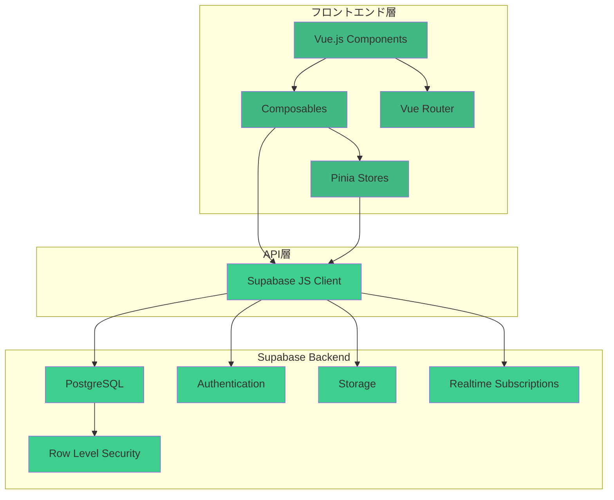
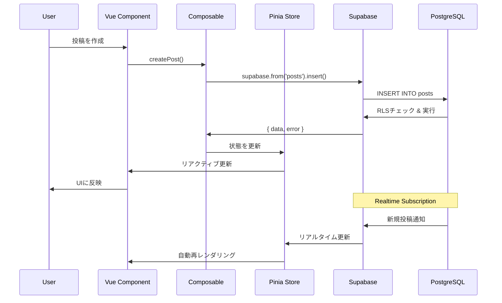
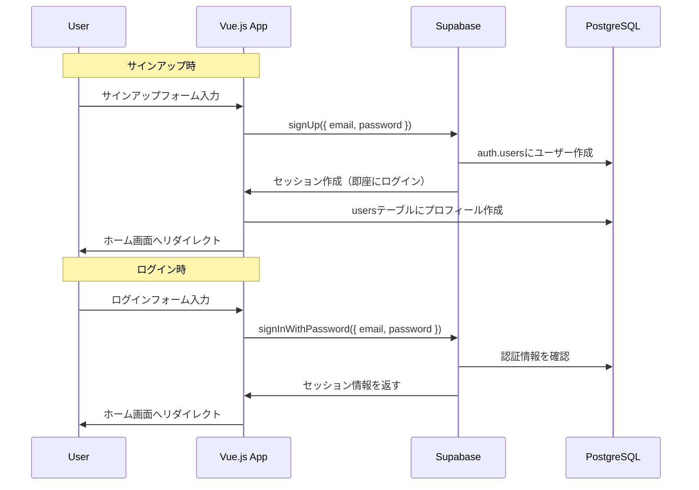

# AGENTS.md

このドキュメントは、本リポジトリで作業するAIエージェント向けの共通ガイドラインです。プロジェクトの目的や開発フロー、守るべきルールを簡潔にまとめています。

---

## 🎯 プロジェクト目標

Twitter風のSNSサービスをVue.js + Supabase + Vercelで構築する。
ショーケース目的のため、シンプルで保守性の高いコードを優先。

---

## 🏗️ システムアーキテクチャ



### データフロー図



---

## 📁 プロジェクト構造

```
twitter-clone/
├── src/
│   ├── assets/              # 静的ファイル
│   │   └── styles/
│   │       └── main.css
│   ├── components/          # Vue コンポーネント
│   │   ├── auth/           # 認証関連
│   │   │   ├── LoginForm.vue
│   │   │   ├── LogoutButton.vue
│   │   │   └── UserProfile.vue
│   │   ├── posts/          # 投稿関連
│   │   │   ├── PostCard.vue
│   │   │   ├── PostForm.vue
│   │   │   ├── Timeline.vue
│   │   │   ├── LikeButton.vue
│   │   │   └── RepostButton.vue
│   │   ├── users/          # ユーザー関連
│   │   │   ├── UserCard.vue
│   │   │   ├── FollowButton.vue
│   │   │   ├── IconPicker.vue
│   │   │   └── ProfileEdit.vue
│   │   └── common/         # 共通コンポーネント
│   │       ├── Header.vue
│   │       ├── Sidebar.vue
│   │       ├── LoadingSpinner.vue
│   │       └── ToastNotification.vue
│   ├── composables/        # Vue Composition API
│   │   ├── useAuth.js      # 認証ロジック
│   │   ├── usePosts.js     # 投稿CRUD（無限スクロール対応）
│   │   ├── useLikes.js     # いいね機能
│   │   ├── useReposts.js   # リポスト機能
│   │   ├── useFollows.js   # フォロー機能
│   │   └── useToast.js     # トースト通知
│   ├── lib/                # ライブラリ設定
│   │   └── supabase.js     # Supabase初期化
│   ├── router/             # Vue Router
│   │   └── index.js
│   ├── stores/             # Pinia Store
│   │   ├── auth.js         # 認証状態
│   │   ├── posts.js        # 投稿データ
│   │   └── users.js        # ユーザーデータ
│   ├── views/              # ページコンポーネント
│   │   ├── Home.vue        # タイムライン
│   │   ├── Profile.vue     # プロフィール
│   │   ├── PostDetail.vue  # 投稿詳細
│   │   └── Login.vue       # ログイン
│   ├── utils/              # ユーティリティ関数
│   │   ├── date.js         # 日付フォーマット
│   │   ├── validation.js   # バリデーション
│   │   └── icons.js        # アイコンプリセット定義
│   ├── App.vue
│   └── main.js
├── public/
├── supabase/               # Supabaseマイグレーション
│   └── migrations/
│       ├── 001_initial_schema.sql
│       ├── 002_add_indexes.sql
│       └── 003_rls_policies.sql
├── .env.example
├── .env
├── .gitignore
├── index.html
├── package.json
├── pnpm-lock.yaml
├── vite.config.js
├── tailwind.config.js
├── postcss.config.js
├── README.md
└── CLAUDE.md
```

---

## 🗄️ Supabase セットアップ

### 1. プロジェクト作成

1. https://supabase.com にアクセス
2. 「New Project」をクリック
3. プロジェクト設定
   - **Name**: `twitter-clone`
   - **Database Password**: 強力なパスワードを生成（保存必須）
   - **Region**: `Northeast Asia (Tokyo)` - ap-northeast-1
   - **Pricing Plan**: Free

### 2. データベーススキーマの作成

**📁 マイグレーションファイルは `supabase/migrations/` ディレクトリに用意されています。**

詳細な実行手順は [supabase/README.md](../supabase/README.md) を参照してください。

#### 実行手順の概要

1. Supabase Dashboard → SQL Editor → New Query
2. 以下のマイグレーションファイルを**順番に**実行：
   - `001_initial_schema.sql` - テーブル作成
   - `002_add_indexes.sql` - インデックス追加
   - `003_rls_policies.sql` - セキュリティポリシー設定
   - `004_views_and_functions.sql` - ビュー・関数作成

3. Realtime有効化（Database → Replication）
   - posts, likes, reposts, followsテーブルを有効化

#### スキーマ構成

**テーブル一覧**:
- `users` - ユーザー情報（icon: アイコンID）
- `posts` - 投稿（reposts_count: リポスト数）
- `likes` - いいね
- `reposts` - リポスト（新規）
- `follows` - フォロー関係

**主要な関数**:
- `increment_likes_count()` / `decrement_likes_count()`
- `increment_reposts_count()` / `decrement_reposts_count()`
- `get_followers_count()` / `get_following_count()`

完全なスキーマとRLSポリシーは `supabase/migrations/` を参照してください。

### 3. Authentication 設定

#### メール/パスワード認証を有効化

1. Supabase Dashboard → Authentication → Providers
2. **Email** が既にデフォルトで有効化されています
3. 設定を確認・変更:
   - **Enable Email provider**: ON
   - **Confirm email**: **OFF**（開発を迅速化するため、メール確認を無効化）
   - **Secure email change**: ON（推奨）

> **重要**: このプロジェクトでは開発効率を優先し、メール確認を無効化します。本番環境では有効化を検討してください。

#### メール確認OFF時の動作

- サインアップ後、即座にログイン可能
- メール確認のステップが不要
- 開発・テスト時のユーザー作成が迅速

#### 認証フロー図（メール確認OFF版）



---

## 💻 Vue.js 実装ガイド

### Supabase クライアントの初期化

#### `src/lib/supabase.js`

```javascript
import { createClient } from '@supabase/supabase-js';

const supabaseUrl = import.meta.env.VITE_SUPABASE_URL;
const supabaseAnonKey = import.meta.env.VITE_SUPABASE_ANON_KEY;

// Supabaseクライアントの初期化
export const supabase = createClient(supabaseUrl, supabaseAnonKey);

/**
 * データベーステーブルの型定義（TypeScript使用時）
 */
export const TABLES = {
  USERS: 'users',
  POSTS: 'posts',
  LIKES: 'likes',
  REPOSTS: 'reposts',
  FOLLOWS: 'follows'
};
```

---

### Composables パターン

#### `src/composables/useAuth.js`

```javascript
import { ref, computed } from 'vue';
import { supabase } from '@/lib/supabase';

// グローバルな認証状態
const user = ref(null);
const session = ref(null);
const loading = ref(true);

export function useAuth() {
  const isAuthenticated = computed(() => !!user.value);

  /**
   * メール/パスワードでサインアップ
   * @param {string} email - メールアドレス
   * @param {string} password - パスワード
   * @param {string} displayName - 表示名
   * @param {string} icon - アイコンID（デフォルト: 'icon-cat'）
   */
  const signUp = async (email, password, displayName, icon = 'icon-cat') => {
    try {
      const { data, error } = await supabase.auth.signUp({
        email,
        password,
        options: {
          data: {
            display_name: displayName,
            icon
          }
        }
      });

      if (error) throw error;

      // Confirm email OFFの場合、即座にセッションが作成されます
      return { data, error: null };
    } catch (error) {
      console.error('サインアップエラー:', error);
      return { data: null, error };
    }
  };

  /**
   * メール/パスワードでログイン
   * @param {string} email - メールアドレス
   * @param {string} password - パスワード
   */
  const signIn = async (email, password) => {
    try {
      const { data, error } = await supabase.auth.signInWithPassword({
        email,
        password
      });
      
      if (error) throw error;
      return { data, error: null };
    } catch (error) {
      console.error('ログインエラー:', error);
      return { data: null, error };
    }
  };

  /**
   * ログアウト
   */
  const signOut = async () => {
    try {
      const { error } = await supabase.auth.signOut();
      if (error) throw error;
      
      user.value = null;
      session.value = null;
    } catch (error) {
      console.error('ログアウトエラー:', error);
      throw error;
    }
  };

  /**
   * パスワードリセットメールを送信
   * @param {string} email - メールアドレス
   */
  const resetPassword = async (email) => {
    try {
      const { data, error } = await supabase.auth.resetPasswordForEmail(email, {
        redirectTo: `${window.location.origin}/auth/reset-password`
      });
      
      if (error) throw error;
      return { data, error: null };
    } catch (error) {
      console.error('パスワードリセットエラー:', error);
      return { data: null, error };
    }
  };

  /**
   * パスワードを更新
   * @param {string} newPassword - 新しいパスワード
   */
  const updatePassword = async (newPassword) => {
    try {
      const { data, error } = await supabase.auth.updateUser({
        password: newPassword
      });
      
      if (error) throw error;
      return { data, error: null };
    } catch (error) {
      console.error('パスワード更新エラー:', error);
      return { data: null, error };
    }
  };

  /**
   * 認証状態の初期化と監視
   */
  const initAuth = async () => {
    try {
      // 現在のセッションを取得
      const { data: { session: currentSession } } = await supabase.auth.getSession();
      session.value = currentSession;
      user.value = currentSession?.user ?? null;

      // ユーザープロフィールをusersテーブルに作成（存在しない場合）
      if (user.value) {
        await ensureUserProfile(user.value);
      }

      // 認証状態の変更を監視
      supabase.auth.onAuthStateChange(async (event, newSession) => {
        console.log('認証状態変更:', event);
        session.value = newSession;
        user.value = newSession?.user ?? null;

        if (event === 'SIGNED_IN' && user.value) {
          await ensureUserProfile(user.value);
        }
      });
    } catch (error) {
      console.error('認証初期化エラー:', error);
    } finally {
      loading.value = false;
    }
  };

  /**
   * ユーザープロフィールが存在しない場合は作成
   * @param {object} authUser - Supabase Authのユーザーオブジェクト
   */
  const ensureUserProfile = async (authUser) => {
    try {
      // 既存のプロフィールをチェック
      const { data: existingProfile } = await supabase
        .from('users')
        .select('id')
        .eq('id', authUser.id)
        .single();

      // プロフィールが存在しない場合は作成
      if (!existingProfile) {
        const displayName = authUser.user_metadata?.display_name 
          || authUser.email.split('@')[0];

        const icon = authUser.user_metadata?.icon || 'icon-cat';

        const { error } = await supabase
          .from('users')
          .insert({
            id: authUser.id,
            email: authUser.email,
            display_name: displayName,
            icon
          });

        if (error) throw error;
      }
    } catch (error) {
      console.error('プロフィール作成エラー:', error);
    }
  };

  return {
    user,
    session,
    loading,
    isAuthenticated,
    signUp,
    signIn,
    signOut,
    resetPassword,
    updatePassword,
    initAuth
  };
}
```

#### `src/composables/usePosts.js`

```javascript
import { ref } from 'vue';
import { supabase } from '@/lib/supabase';

export function usePosts() {
  const posts = ref([]);
  const loading = ref(false);
  const error = ref(null);

  /**
   * タイムラインの投稿を取得（ユーザー情報とJOIN）
   * @param {number} limit - 取得する投稿数
   */
  const fetchTimeline = async (limit = 50) => {
    loading.value = true;
    error.value = null;

    try {
      const { data, error: fetchError } = await supabase
        .from('posts')
        .select(`
          *,
          users (
            display_name,
            icon
          )
        `)
        .order('created_at', { ascending: false })
        .limit(limit);

      if (fetchError) throw fetchError;
      
      posts.value = data;
      return { data, error: null };
    } catch (err) {
      console.error('タイムライン取得エラー:', err);
      error.value = err.message;
      return { data: null, error: err };
    } finally {
      loading.value = false;
    }
  };

  /**
   * 特定ユーザーの投稿を取得
   * @param {string} userId - ユーザーID
   */
  const fetchUserPosts = async (userId) => {
    loading.value = true;
    error.value = null;

    try {
      const { data, error: fetchError } = await supabase
        .from('posts')
        .select(`
          *,
          users (
            display_name,
            icon
          )
        `)
        .eq('user_id', userId)
        .order('created_at', { ascending: false });

      if (fetchError) throw fetchError;
      
      return { data, error: null };
    } catch (err) {
      console.error('ユーザー投稿取得エラー:', err);
      error.value = err.message;
      return { data: null, error: err };
    } finally {
      loading.value = false;
    }
  };

  /**
   * 投稿を作成
   * @param {string} text - 投稿内容
   * @param {string} userId - 投稿者ID
   */
  const createPost = async (text, userId) => {
    loading.value = true;
    error.value = null;

    try {
      const { data, error: insertError } = await supabase
        .from('posts')
        .insert({
          user_id: userId,
          text: text.trim()
        })
        .select(`
          *,
          users (
            display_name,
            icon
          )
        `)
        .single();

      if (insertError) throw insertError;
      
      // ローカルの投稿リストに追加
      posts.value.unshift(data);
      
      return { data, error: null };
    } catch (err) {
      console.error('投稿作成エラー:', err);
      error.value = err.message;
      return { data: null, error: err };
    } finally {
      loading.value = false;
    }
  };

  /**
   * 投稿を削除
   * @param {string} postId - 投稿ID
   */
  const deletePost = async (postId) => {
    loading.value = true;
    error.value = null;

    try {
      const { error: deleteError } = await supabase
        .from('posts')
        .delete()
        .eq('id', postId);

      if (deleteError) throw deleteError;
      
      // ローカルの投稿リストから削除
      posts.value = posts.value.filter(post => post.id !== postId);
      
      return { error: null };
    } catch (err) {
      console.error('投稿削除エラー:', err);
      error.value = err.message;
      return { error: err };
    } finally {
      loading.value = false;
    }
  };

  /**
   * リアルタイムで投稿を購読
   */
  const subscribeToTimeline = () => {
    const channel = supabase
      .channel('timeline-posts')
      .on(
        'postgres_changes',
        {
          event: 'INSERT',
          schema: 'public',
          table: 'posts'
        },
        async (payload) => {
          // 新規投稿をユーザー情報と共に取得
          const { data } = await supabase
            .from('posts')
            .select(`
              *,
              users (
                display_name,
                icon
              )
            `)
            .eq('id', payload.new.id)
            .single();

          if (data) {
            posts.value.unshift(data);
          }
        }
      )
      .on(
        'postgres_changes',
        {
          event: 'DELETE',
          schema: 'public',
          table: 'posts'
        },
        (payload) => {
          posts.value = posts.value.filter(post => post.id !== payload.old.id);
        }
      )
      .subscribe();

    // クリーンアップ関数を返す
    return () => {
      supabase.removeChannel(channel);
    };
  };

  return {
    posts,
    loading,
    error,
    fetchTimeline,
    fetchUserPosts,
    createPost,
    deletePost,
    subscribeToTimeline
  };
}
```

#### `src/composables/useLikes.js`

```javascript
import { ref } from 'vue';
import { supabase } from '@/lib/supabase';

export function useLikes() {
  const loading = ref(false);
  const error = ref(null);

  /**
   * いいねを追加
   * @param {string} postId - 投稿ID
   * @param {string} userId - ユーザーID
   */
  const likePost = async (postId, userId) => {
    loading.value = true;
    error.value = null;

    try {
      // いいねを追加
      const { error: insertError } = await supabase
        .from('likes')
        .insert({
          post_id: postId,
          user_id: userId
        });

      if (insertError) throw insertError;

      // 投稿のいいね数を更新
      const { error: updateError } = await supabase.rpc('increment_likes_count', {
        post_id: postId
      });

      if (updateError) throw updateError;

      return { error: null };
    } catch (err) {
      console.error('いいねエラー:', err);
      error.value = err.message;
      return { error: err };
    } finally {
      loading.value = false;
    }
  };

  /**
   * いいねを削除
   * @param {string} postId - 投稿ID
   * @param {string} userId - ユーザーID
   */
  const unlikePost = async (postId, userId) => {
    loading.value = true;
    error.value = null;

    try {
      // いいねを削除
      const { error: deleteError } = await supabase
        .from('likes')
        .delete()
        .eq('post_id', postId)
        .eq('user_id', userId);

      if (deleteError) throw deleteError;

      // 投稿のいいね数を更新
      const { error: updateError } = await supabase.rpc('decrement_likes_count', {
        post_id: postId
      });

      if (updateError) throw updateError;

      return { error: null };
    } catch (err) {
      console.error('いいね解除エラー:', err);
      error.value = err.message;
      return { error: err };
    } finally {
      loading.value = false;
    }
  };

  /**
   * ユーザーが投稿をいいねしているか確認
   * @param {string} postId - 投稿ID
   * @param {string} userId - ユーザーID
   */
  const checkLiked = async (postId, userId) => {
    try {
      const { data, error: fetchError } = await supabase
        .from('likes')
        .select('id')
        .eq('post_id', postId)
        .eq('user_id', userId)
        .single();

      if (fetchError && fetchError.code !== 'PGRST116') throw fetchError;

      return { liked: !!data, error: null };
    } catch (err) {
      console.error('いいね確認エラー:', err);
      return { liked: false, error: err };
    }
  };

  return {
    loading,
    error,
    likePost,
    unlikePost,
    checkLiked
  };
}
```

---

### 新機能の実装ガイド

#### `src/utils/icons.js` - アイコンプリセットシステム

```javascript
/**
 * ユーザーアイコンのプリセット定義
 */
export const USER_ICONS = [
  { id: 'icon-cat', emoji: '🐱', name: '猫' },
  { id: 'icon-dog', emoji: '🐶', name: '犬' },
  { id: 'icon-bear', emoji: '🐻', name: '熊' },
  { id: 'icon-fox', emoji: '🦊', name: '狐' },
  { id: 'icon-panda', emoji: '🐼', name: 'パンダ' },
  { id: 'icon-koala', emoji: '🐨', name: 'コアラ' },
  { id: 'icon-tiger', emoji: '🐯', name: '虎' },
  { id: 'icon-lion', emoji: '🦁', name: 'ライオン' },
  { id: 'icon-monkey', emoji: '🐵', name: '猿' },
  { id: 'icon-rabbit', emoji: '🐰', name: 'うさぎ' },
  { id: 'icon-mouse', emoji: '🐭', name: 'ねずみ' },
  { id: 'icon-hamster', emoji: '🐹', name: 'ハムスター' },
  { id: 'icon-bird', emoji: '🐦', name: '鳥' },
  { id: 'icon-penguin', emoji: '🐧', name: 'ペンギン' },
  { id: 'icon-frog', emoji: '🐸', name: 'カエル' },
  { id: 'icon-pig', emoji: '🐷', name: '豚' },
  { id: 'icon-cow', emoji: '🐮', name: '牛' },
  { id: 'icon-dragon', emoji: '🐲', name: '龍' },
  { id: 'icon-unicorn', emoji: '🦄', name: 'ユニコーン' },
  { id: 'icon-alien', emoji: '👽', name: 'エイリアン' }
];

/**
 * デフォルトアイコン
 */
export const DEFAULT_ICON = 'icon-cat';

/**
 * アイコンIDから絵文字を取得
 * @param {string} iconId - アイコンID
 * @returns {string} 絵文字
 */
export function getIconEmoji(iconId) {
  const icon = USER_ICONS.find(i => i.id === iconId);
  return icon ? icon.emoji : '👤';
}

/**
 * アイコンIDからアイコン情報を取得
 * @param {string} iconId - アイコンID
 * @returns {object|null} アイコン情報
 */
export function getIconById(iconId) {
  return USER_ICONS.find(i => i.id === iconId) || null;
}
```

#### `src/composables/useReposts.js` - リポスト機能

```javascript
import { ref } from 'vue';
import { supabase } from '@/lib/supabase';

export function useReposts() {
  const loading = ref(false);
  const error = ref(null);

  /**
   * リポストを作成
   * @param {string} postId - 投稿ID
   * @param {string} userId - ユーザーID
   */
  const repostPost = async (postId, userId) => {
    loading.value = true;
    error.value = null;

    try {
      // リポストを追加
      const { error: insertError } = await supabase
        .from('reposts')
        .insert({
          post_id: postId,
          user_id: userId
        });

      if (insertError) throw insertError;

      // 投稿のリポスト数を更新
      const { error: updateError } = await supabase.rpc('increment_reposts_count', {
        post_id: postId
      });

      if (updateError) throw updateError;

      return { error: null };
    } catch (err) {
      console.error('リポストエラー:', err);
      error.value = err.message;
      return { error: err };
    } finally {
      loading.value = false;
    }
  };

  /**
   * リポストを削除
   * @param {string} postId - 投稿ID
   * @param {string} userId - ユーザーID
   */
  const unrepostPost = async (postId, userId) => {
    loading.value = true;
    error.value = null;

    try {
      // リポストを削除
      const { error: deleteError } = await supabase
        .from('reposts')
        .delete()
        .eq('post_id', postId)
        .eq('user_id', userId);

      if (deleteError) throw deleteError;

      // 投稿のリポスト数を更新
      const { error: updateError } = await supabase.rpc('decrement_reposts_count', {
        post_id: postId
      });

      if (updateError) throw updateError;

      return { error: null };
    } catch (err) {
      console.error('リポスト解除エラー:', err);
      error.value = err.message;
      return { error: err };
    } finally {
      loading.value = false;
    }
  };

  /**
   * ユーザーが投稿をリポストしているか確認
   * @param {string} postId - 投稿ID
   * @param {string} userId - ユーザーID
   */
  const checkReposted = async (postId, userId) => {
    try {
      const { data, error: fetchError } = await supabase
        .from('reposts')
        .select('id')
        .eq('post_id', postId)
        .eq('user_id', userId)
        .single();

      if (fetchError && fetchError.code !== 'PGRST116') throw fetchError;

      return { reposted: !!data, error: null };
    } catch (err) {
      console.error('リポスト確認エラー:', err);
      return { reposted: false, error: err };
    }
  };

  return {
    loading,
    error,
    repostPost,
    unrepostPost,
    checkReposted
  };
}
```

#### `src/composables/useToast.js` - トースト通知システム

```javascript
import { ref } from 'vue';

const toasts = ref([]);
let toastId = 0;

export function useToast() {
  /**
   * トースト通知を表示
   * @param {string} message - メッセージ
   * @param {string} type - タイプ ('success', 'error', 'warning', 'info')
   * @param {number} duration - 表示時間（ミリ秒）
   */
  const showToast = (message, type = 'info', duration = 3000) => {
    const id = toastId++;
    const toast = {
      id,
      message,
      type,
      visible: true
    };

    toasts.value.push(toast);

    // 指定時間後に自動で非表示
    setTimeout(() => {
      removeToast(id);
    }, duration);

    return id;
  };

  /**
   * トーストを削除
   * @param {number} id - トーストID
   */
  const removeToast = (id) => {
    const index = toasts.value.findIndex(t => t.id === id);
    if (index !== -1) {
      toasts.value.splice(index, 1);
    }
  };

  /**
   * 成功メッセージを表示
   * @param {string} message - メッセージ
   */
  const success = (message) => showToast(message, 'success');

  /**
   * エラーメッセージを表示
   * @param {string} message - メッセージ
   */
  const errorToast = (message) => showToast(message, 'error');

  /**
   * 警告メッセージを表示
   * @param {string} message - メッセージ
   */
  const warning = (message) => showToast(message, 'warning');

  /**
   * 情報メッセージを表示
   * @param {string} message - メッセージ
   */
  const info = (message) => showToast(message, 'info');

  return {
    toasts,
    showToast,
    removeToast,
    success,
    error: errorToast,
    warning,
    info
  };
}
```

#### `src/components/common/ToastNotification.vue`

```vue
<script setup>
import { useToast } from '@/composables/useToast';

const { toasts, removeToast } = useToast();

/**
 * タイプに応じたスタイルクラスを取得
 */
const getToastClass = (type) => {
  const baseClass = 'px-6 py-4 rounded-lg shadow-lg text-white mb-4 transition-all duration-300';
  const typeClasses = {
    success: 'bg-green-500',
    error: 'bg-red-500',
    warning: 'bg-yellow-500',
    info: 'bg-blue-500'
  };
  return `${baseClass} ${typeClasses[type] || typeClasses.info}`;
};
</script>

<template>
  <div class="fixed top-4 right-4 z-50 max-w-md">
    <transition-group name="toast">
      <div
        v-for="toast in toasts"
        :key="toast.id"
        :class="getToastClass(toast.type)"
        @click="removeToast(toast.id)"
      >
        <div class="flex items-center justify-between">
          <span>{{ toast.message }}</span>
          <button
            class="ml-4 text-white hover:text-gray-200"
            @click="removeToast(toast.id)"
          >
            ✕
          </button>
        </div>
      </div>
    </transition-group>
  </div>
</template>

<style scoped>
.toast-enter-active,
.toast-leave-active {
  transition: all 0.3s ease;
}

.toast-enter-from {
  opacity: 0;
  transform: translateX(100%);
}

.toast-leave-to {
  opacity: 0;
  transform: translateX(100%);
}
</style>
```

---

### データベース関数の追加

いいね数・リポスト数のカウント管理を効率化するため、以下の関数をSupabaseに追加します：

```sql
-- いいね数を増やす関数
CREATE OR REPLACE FUNCTION increment_likes_count(post_id UUID)
RETURNS VOID AS $$
BEGIN
  UPDATE posts
  SET likes_count = likes_count + 1
  WHERE id = post_id;
END;
$$ LANGUAGE plpgsql SECURITY DEFINER;

-- いいね数を減らす関数
CREATE OR REPLACE FUNCTION decrement_likes_count(post_id UUID)
RETURNS VOID AS $$
BEGIN
  UPDATE posts
  SET likes_count = GREATEST(likes_count - 1, 0)
  WHERE id = post_id;
END;
$$ LANGUAGE plpgsql SECURITY DEFINER;

-- リポスト数を増やす関数
CREATE OR REPLACE FUNCTION increment_reposts_count(post_id UUID)
RETURNS VOID AS $$
BEGIN
  UPDATE posts
  SET reposts_count = reposts_count + 1
  WHERE id = post_id;
END;
$$ LANGUAGE plpgsql SECURITY DEFINER;

-- リポスト数を減らす関数
CREATE OR REPLACE FUNCTION decrement_reposts_count(post_id UUID)
RETURNS VOID AS $$
BEGIN
  UPDATE posts
  SET reposts_count = GREATEST(reposts_count - 1, 0)
  WHERE id = post_id;
END;
$$ LANGUAGE plpgsql SECURITY DEFINER;
```

---

## 🎨 コンポーネント実装例

### LoginForm.vue（サインアップ・ログイン）

```vue
<script setup>
import { ref } from 'vue';
import { useRouter } from 'vue-router';
import { useAuth } from '@/composables/useAuth';

const router = useRouter();
const { signUp, signIn } = useAuth();

const isSignUp = ref(false); // サインアップモードかログインモードか
const email = ref('');
const password = ref('');
const displayName = ref('');
const selectedIcon = ref('icon-cat');
const error = ref('');
const loading = ref(false);

/**
 * フォームを送信
 */
const handleSubmit = async () => {
  error.value = '';
  loading.value = true;

  try {
    if (isSignUp.value) {
      // サインアップ
      if (!displayName.value.trim()) {
        error.value = '表示名を入力してください';
        return;
      }

      const { error: signUpError } = await signUp(
        email.value,
        password.value,
        displayName.value,
        selectedIcon.value
      );

      if (signUpError) {
        error.value = signUpError.message;
        return;
      }

      // Confirm email OFFの場合、即座にログインしてホームへ
      router.push('/');
    } else {
      // ログイン
      const { error: signInError } = await signIn(email.value, password.value);

      if (signInError) {
        error.value = 'メールアドレスまたはパスワードが正しくありません';
        return;
      }

      router.push('/');
    }
  } catch (err) {
    error.value = 'エラーが発生しました';
  } finally {
    loading.value = false;
  }
};

/**
 * モードを切り替え（サインアップ⇔ログイン）
 */
const toggleMode = () => {
  isSignUp.value = !isSignUp.value;
  error.value = '';
};
</script>

<template>
  <div class="min-h-screen flex items-center justify-center bg-gray-50 py-12 px-4">
    <div class="max-w-md w-full space-y-8">
      <div>
        <h2 class="mt-6 text-center text-3xl font-extrabold text-gray-900">
          {{ isSignUp ? 'アカウント作成' : 'ログイン' }}
        </h2>
      </div>

      <!-- エラーメッセージ -->
      <div v-if="error" class="bg-red-50 border border-red-200 text-red-600 px-4 py-3 rounded">
        {{ error }}
      </div>

      <form @submit.prevent="handleSubmit" class="mt-8 space-y-6">
        <div class="rounded-md shadow-sm space-y-4">
          <!-- 表示名（サインアップ時のみ） -->
          <div v-if="isSignUp">
            <label for="displayName" class="sr-only">表示名</label>
            <input
              id="displayName"
              v-model="displayName"
              type="text"
              required
              class="appearance-none rounded relative block w-full px-3 py-2 border border-gray-300 placeholder-gray-500 text-gray-900 focus:outline-none focus:ring-blue-500 focus:border-blue-500"
              placeholder="表示名"
            />
          </div>

          <!-- メールアドレス -->
          <div>
            <label for="email" class="sr-only">メールアドレス</label>
            <input
              id="email"
              v-model="email"
              type="email"
              required
              class="appearance-none rounded relative block w-full px-3 py-2 border border-gray-300 placeholder-gray-500 text-gray-900 focus:outline-none focus:ring-blue-500 focus:border-blue-500"
              placeholder="メールアドレス"
            />
          </div>

          <!-- パスワード -->
          <div>
            <label for="password" class="sr-only">パスワード</label>
            <input
              id="password"
              v-model="password"
              type="password"
              required
              minlength="6"
              class="appearance-none rounded relative block w-full px-3 py-2 border border-gray-300 placeholder-gray-500 text-gray-900 focus:outline-none focus:ring-blue-500 focus:border-blue-500"
              placeholder="パスワード（6文字以上）"
            />
          </div>
        </div>

        <!-- 送信ボタン -->
        <div>
          <button
            type="submit"
            :disabled="loading"
            class="group relative w-full flex justify-center py-2 px-4 border border-transparent text-sm font-medium rounded-md text-white bg-blue-600 hover:bg-blue-700 focus:outline-none focus:ring-2 focus:ring-offset-2 focus:ring-blue-500 disabled:opacity-50"
          >
            {{ loading ? '処理中...' : (isSignUp ? 'アカウント作成' : 'ログイン') }}
          </button>
        </div>

        <!-- モード切り替え -->
        <div class="text-center">
          <button
            type="button"
            @click="toggleMode"
            class="text-blue-600 hover:text-blue-500"
          >
            {{ isSignUp ? 'すでにアカウントをお持ちの方' : 'アカウントをお持ちでない方' }}
          </button>
        </div>
      </form>
    </div>
  </div>
</template>
```

### PostCard.vue

```vue
<script setup>
import { ref, computed } from 'vue';
import { useAuth } from '@/composables/useAuth';
import { usePosts } from '@/composables/usePosts';
import { useLikes } from '@/composables/useLikes';
import { getIconEmoji } from '@/utils/icons';

const props = defineProps({
  post: {
    type: Object,
    required: true
  }
});

const { user } = useAuth();
const { deletePost } = usePosts();
const { likePost, unlikePost, checkLiked } = useLikes();

const isLiked = ref(false);
const isDeleting = ref(false);

// 自分の投稿かどうか
const isOwnPost = computed(() => user.value?.id === props.post.user_id);

// いいね状態の初期化
const initLikeStatus = async () => {
  if (user.value) {
    const { liked } = await checkLiked(props.post.id, user.value.id);
    isLiked.value = liked;
  }
};

// いいね/いいね解除のトグル
const toggleLike = async () => {
  if (!user.value) return;

  if (isLiked.value) {
    await unlikePost(props.post.id, user.value.id);
    isLiked.value = false;
  } else {
    await likePost(props.post.id, user.value.id);
    isLiked.value = true;
  }
};

// 投稿の削除
const handleDelete = async () => {
  if (!confirm('この投稿を削除しますか？')) return;
  
  isDeleting.value = true;
  await deletePost(props.post.id);
  isDeleting.value = false;
};

// コンポーネントマウント時にいいね状態を取得
initLikeStatus();
</script>

<template>
  <div class="border-b border-gray-200 p-4 hover:bg-gray-50">
    <!-- ユーザー情報 -->
    <div class="flex items-start gap-3">
      <div class="w-12 h-12 rounded-full bg-gray-200 flex items-center justify-center text-2xl">
        {{ getIconEmoji(post.users.icon) }}
      </div>
      
      <div class="flex-1">
        <!-- 名前と投稿日時 -->
        <div class="flex items-center justify-between">
          <div>
            <span class="font-bold">{{ post.users.display_name }}</span>
            <span class="text-gray-500 text-sm ml-2">
              {{ formatDate(post.created_at) }}
            </span>
          </div>
          
          <!-- 削除ボタン（自分の投稿のみ） -->
          <button
            v-if="isOwnPost"
            @click="handleDelete"
            :disabled="isDeleting"
            class="text-red-500 hover:text-red-700"
          >
            削除
          </button>
        </div>
        
        <!-- 投稿内容 -->
        <p class="mt-2 whitespace-pre-wrap">{{ post.text }}</p>
        
        <!-- アクション -->
        <div class="flex items-center gap-6 mt-3 text-gray-500">
          <!-- いいねボタン -->
          <button 
            @click="toggleLike"
            class="flex items-center gap-1 hover:text-red-500"
            :class="{ 'text-red-500': isLiked }"
          >
            <span>{{ isLiked ? '❤️' : '🤍' }}</span>
            <span>{{ post.likes_count }}</span>
          </button>
        </div>
      </div>
    </div>
  </div>
</template>
```

---

## 🚀 実装の優先順位

### Phase 1: 基本機能（MVP）
1. ✅ Supabaseプロジェクトセットアップ
2. ✅ データベーススキーマ作成
3. ✅ RLSポリシー設定
4. **メール/パスワード認証実装**
   - LoginForm.vue（サインアップ・ログイン統合）
   - useAuth composable
   - パスワードリセット機能
5. **アイコンシステム実装**
   - icons.js（プリセット定義）
   - IconPicker.vue（アイコン選択UI）
6. **投稿機能**
   - PostForm.vue（文字数カウンター付き）
   - PostCard.vue
   - Timeline.vue（タブ機能：「ホーム」「すべて」）
   - usePosts composable（無限スクロール対応）
7. **基本レイアウト**
   - Header.vue
   - Home.vue（タブ切り替え機能）
   - ToastNotification.vue（トースト通知システム）

### Phase 2: インタラクション
1. **いいね機能**
   - LikeButton.vue
   - useLikes composable
   - いいね数のリアルタイム更新
2. **リポスト機能**
   - RepostButton.vue
   - useReposts composable
   - リポスト数のリアルタイム更新
3. **投稿削除機能**

### Phase 3: 拡張機能
1. **プロフィールページ**
   - Profile.vue
   - UserCard.vue
   - ProfileEdit.vue（表示名・アイコン・自己紹介・パスワード編集）
2. **フォロー機能**
   - FollowButton.vue
   - useFollows composable
   - フォロー数のリアルタイム更新
3. **タイムライン分離**
   - 「ホーム」タブ：フォロー中のユーザーの投稿
   - 「すべて」タブ：全ユーザーの投稿

### Phase 4: 追加機能（オプション）
1. **ハッシュタグ機能**
   - ハッシュタグの抽出と保存
   - ハッシュタグ検索
2. **検索機能**
   - ユーザー検索
   - 投稿検索
3. **通知機能**
   - いいね通知
   - フォロー通知
   - リポスト通知

---

## 💡 開発のヒント

### Claude Code CLI での開発時
1. このファイル（CLAUDE.md）とREADME.mdを必ず参照
2. コンポーネントは小さく分割して再利用性を高める
3. Supabase操作はcomposablesに集約
4. エラーハンドリングを必ず実装
5. コンソールログで動作確認しながら進める
6. **機能実装後は必ずドキュメントを更新**
7. **コミット前にCLAUDE.mdの方針に沿っているか確認**
8. **RLSポリシーを理解してから実装を開始**

### コード品質
- ESLintとPrettierを使用
- コミット前にlintチェック
- コンポーネントは100行以内を目安に
- **日本語でわかりやすいコメントを記述**
- **変数名・関数名は英語、コメントは日本語**
- SQLクエリは可読性を重視してフォーマット

### Pull Request のテンプレート
```markdown
## 変更内容
<!-- 何を変更したか簡潔に説明 -->

## 変更理由
<!-- なぜこの変更が必要か -->

## 影響範囲
<!-- どのファイル・機能に影響するか -->

## テスト内容
- [ ] ローカルで動作確認済み
- [ ] RLSポリシーを確認
- [ ] レスポンシブ対応を確認
- [ ] エラーハンドリングを確認

## スクリーンショット
<!-- UI変更がある場合は画像を添付 -->

## 関連Issue
<!-- 関連するIssue番号があれば記載 -->

## チェックリスト
- [ ] コードコメントを日本語で記述
- [ ] コミットメッセージを日本語で記述
- [ ] README.md/CLAUDE.mdを更新（必要な場合）
- [ ] Lintエラーがない
- [ ] 不要なconsole.logを削除
- [ ] Supabase RLSポリシーが正しく動作
```

---

## 🔍 トラブルシューティング

### よくある問題

#### 1. RLS エラー: "new row violates row-level security policy"
**原因**: RLSポリシーが正しく設定されていない  
**解決**: 
- Supabase Dashboard → Authentication でユーザーがログインしているか確認
- SQL Editorでポリシーを確認
- `auth.uid()`が正しく機能しているか確認

#### 2. 認証エラー: "Invalid Refresh Token"
**原因**: セッションの有効期限切れ  
**解決**: 
- ログアウトして再ログイン
- `supabase.auth.refreshSession()`を実行

#### 3. CORS エラー
**原因**: Vercelの本番URLがSupabaseの許可リストに未登録  
**解決**: 
- Supabase Dashboard → Settings → API
- Site URLとRedirect URLsに本番URLを追加

#### 4. リアルタイム更新が動作しない
**原因**: Realtimeが有効化されていない  
**解決**:
- Supabase Dashboard → Database → Replication
- 該当テーブルのRealtimeを有効化

---

## 📚 参考リソース

- [Vue.js 公式ドキュメント](https://ja.vuejs.org/)
- [Supabase 公式ドキュメント](https://supabase.com/docs)
- [Supabase JavaScript SDK](https://supabase.com/docs/reference/javascript/introduction)
- [PostgreSQL ドキュメント](https://www.postgresql.jp/document/)
- [Vercel ドキュメント](https://vercel.com/docs)
- [Tailwind CSS](https://tailwindcss.com/)

