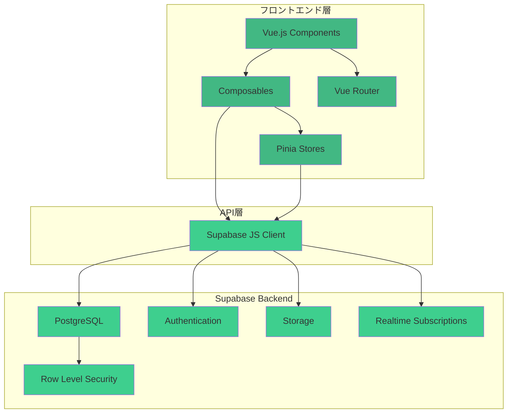
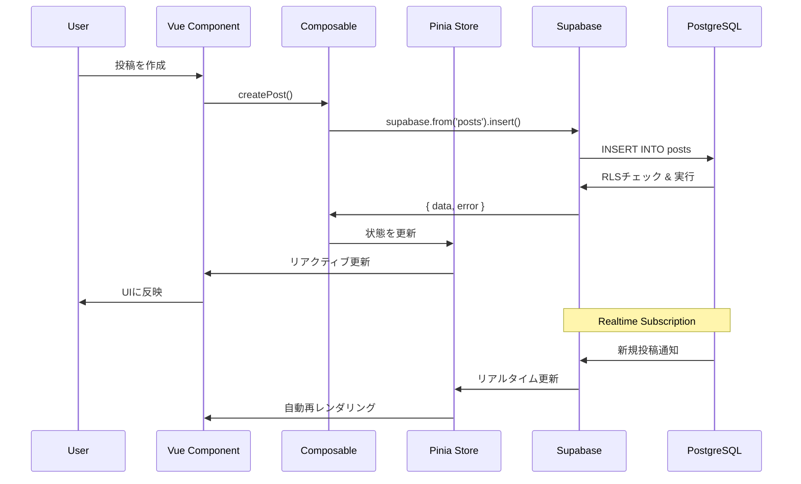
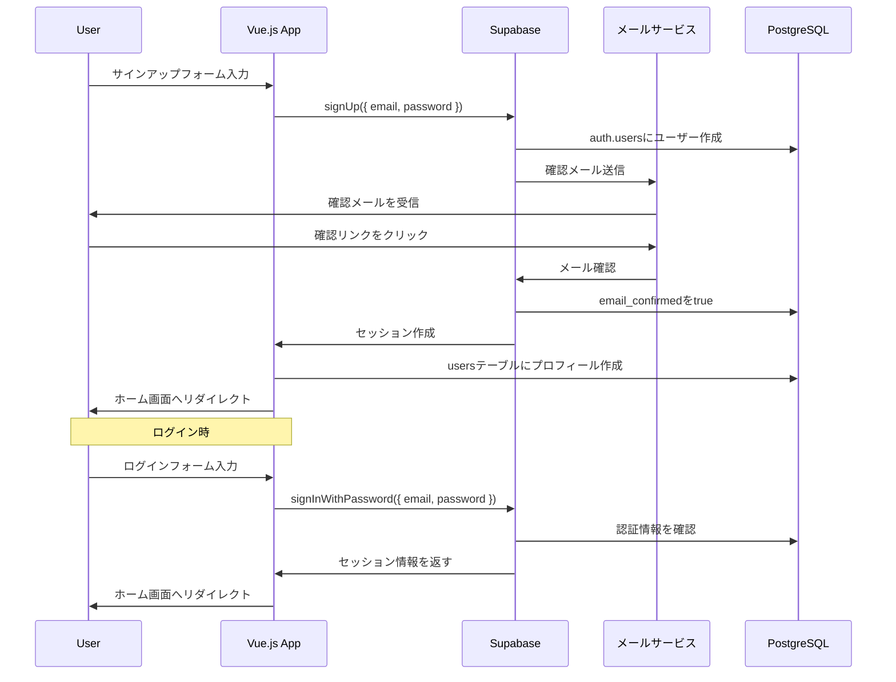

### Phase 1: 基本機能（MVP）
1. ✅ Supabaseプロジェクトセットアップ
2. ✅ データベーススキーマ作成
3. ✅ RLSポリシー設定
4. メール/パスワード認証実装
   - LoginForm.vue（サインアップ・ログイン）
   - useAuth composable
   - パスワードリ# CLAUDE.md - 実装方針ドキュメント

このドキュメントはClaude Code CLIでの開発時に参照するための実装ガイドラインです。

## 📋 重要な方針

### パッケージマネージャー
このプロジェクトでは **pnpm** を使用します。npm や yarn は使用しないでください。

```bash
# pnpmのインストール
npm install -g pnpm

# 依存関係のインストール
pnpm install

# パッケージの追加
pnpm add [package-name]

# 開発用パッケージの追加
pnpm add -D [package-name]
```

### 言語方針
**すべての開発関連コミュニケーションを日本語で統一します。**

#### 日本語で記述するもの
- ✅ コードコメント
- ✅ Gitコミットメッセージ
- ✅ Pull Requestのタイトル・説明
- ✅ コードレビューコメント
- ✅ Issue/タスク管理
- ✅ チャットでの技術議論

#### コミットメッセージの規約
```bash
# プレフィックスを使用した日本語コミットメッセージ
feat: 新機能の追加
fix: バグ修正
docs: ドキュメントの更新
style: コードスタイルの修正（機能変更なし）
refactor: リファクタリング
test: テストの追加・修正
chore: ビルドプロセスやツールの変更
perf: パフォーマンス改善
db: データベーススキーマの変更

# 例
git commit -m "feat: メール/パスワード認証機能を実装"
git commit -m "fix: タイムラインの投稿が重複表示される問題を修正"
git commit -m "docs: CLAUDE.mdにER図を追加"
git commit -m "db: likesテーブルにインデックスを追加"
git commit -m "refactor: usePosts composableを関数単位で分割"
```

### ドキュメント管理方針
**実装の進捗に応じてドキュメントを必ず更新します。**

#### 更新が必要なタイミング
1. **機能実装完了時**
   - README.mdの機能リストを更新
   - CLAUDE.mdに実装パターンを追加
   
2. **データ構造変更時**
   - README.mdのER図を更新
   - CLAUDE.mdのテーブル定義・マイグレーションSQLを更新

3. **設定変更時**
   - セットアップ手順の更新
   - 環境変数の追加・変更
   - RLS（Row Level Security）ポリシーの更新

4. **技術的な意思決定時**
   - 新しいライブラリの採用理由
   - アーキテクチャの変更理由
   - パフォーマンス最適化の手法

#### ドキュメント更新の手順
```bash
# 1. 機能実装
git add src/components/NewFeature.vue

# 2. ドキュメント更新
git add README.md CLAUDE.md

# 3. まとめてコミット
git commit -m "feat: 新機能を実装し、ドキュメントを更新"
```

---

## 🎯 プロジェクト目標

Twitter風のSNSサービスをVue.js + Supabase + Vercelで構築する。
ショーケース目的のため、シンプルで保守性の高いコードを優先。

---

## 🏗️ システムアーキテクチャ



### データフロー図



---

## 📁 プロジェクト構造

```
twitter-clone/
├── src/
│   ├── assets/              # 静的ファイル
│   │   └── styles/
│   │       └── main.css
│   ├── components/          # Vue コンポーネント
│   │   ├── auth/           # 認証関連
│   │   │   ├── LoginButton.vue
│   │   │   ├── LogoutButton.vue
│   │   │   └── UserProfile.vue
│   │   ├── posts/          # 投稿関連
│   │   │   ├── PostCard.vue
│   │   │   ├── PostForm.vue
│   │   │   ├── Timeline.vue
│   │   │   └── LikeButton.vue
│   │   ├── users/          # ユーザー関連
│   │   │   ├── UserCard.vue
│   │   │   └── FollowButton.vue
│   │   └── common/         # 共通コンポーネント
│   │       ├── Header.vue
│   │       ├── Sidebar.vue
│   │       ├── LoadingSpinner.vue
│   │       └── ErrorMessage.vue
│   ├── composables/        # Vue Composition API
│   │   ├── useAuth.js      # 認証ロジック
│   │   ├── usePosts.js     # 投稿CRUD
│   │   ├── useLikes.js     # いいね機能
│   │   └── useFollows.js   # フォロー機能
│   ├── lib/                # ライブラリ設定
│   │   └── supabase.js     # Supabase初期化
│   ├── router/             # Vue Router
│   │   └── index.js
│   ├── stores/             # Pinia Store
│   │   ├── auth.js         # 認証状態
│   │   ├── posts.js        # 投稿データ
│   │   └── users.js        # ユーザーデータ
│   ├── views/              # ページコンポーネント
│   │   ├── Home.vue        # タイムライン
│   │   ├── Profile.vue     # プロフィール
│   │   ├── PostDetail.vue  # 投稿詳細
│   │   └── Login.vue       # ログイン
│   ├── utils/              # ユーティリティ関数
│   │   ├── date.js         # 日付フォーマット
│   │   └── validation.js   # バリデーション
│   ├── App.vue
│   └── main.js
├── public/
├── supabase/               # Supabaseマイグレーション
│   └── migrations/
│       ├── 001_initial_schema.sql
│       ├── 002_add_indexes.sql
│       └── 003_rls_policies.sql
├── .env.example
├── .env
├── .gitignore
├── index.html
├── package.json
├── pnpm-lock.yaml
├── vite.config.js
├── tailwind.config.js
├── postcss.config.js
├── README.md
└── CLAUDE.md
```

---

## 🗄️ Supabase セットアップ

### 1. プロジェクト作成

1. https://supabase.com にアクセス
2. 「New Project」をクリック
3. プロジェクト設定
   - **Name**: `twitter-clone`
   - **Database Password**: 強力なパスワードを生成（保存必須）
   - **Region**: `Northeast Asia (Tokyo)` - ap-northeast-1
   - **Pricing Plan**: Free

### 2. データベーススキーマの作成

Supabase Dashboard → SQL Editor → New Query

#### マイグレーション1: 初期スキーマ

```sql
-- UUIDの拡張を有効化
CREATE EXTENSION IF NOT EXISTS "uuid-ossp";

-- usersテーブル
CREATE TABLE users (
  id UUID PRIMARY KEY REFERENCES auth.users(id) ON DELETE CASCADE,
  email TEXT UNIQUE NOT NULL,
  display_name TEXT NOT NULL,
  photo_url TEXT,
  bio TEXT,
  created_at TIMESTAMP WITH TIME ZONE DEFAULT NOW(),
  updated_at TIMESTAMP WITH TIME ZONE DEFAULT NOW()
);

-- postsテーブル
CREATE TABLE posts (
  id UUID PRIMARY KEY DEFAULT uuid_generate_v4(),
  user_id UUID REFERENCES users(id) ON DELETE CASCADE NOT NULL,
  text TEXT NOT NULL CHECK (char_length(text) <= 280 AND char_length(text) > 0),
  likes_count INTEGER DEFAULT 0 CHECK (likes_count >= 0),
  retweets_count INTEGER DEFAULT 0 CHECK (retweets_count >= 0),
  replies_count INTEGER DEFAULT 0 CHECK (replies_count >= 0),
  created_at TIMESTAMP WITH TIME ZONE DEFAULT NOW()
);

-- likesテーブル
CREATE TABLE likes (
  id UUID PRIMARY KEY DEFAULT uuid_generate_v4(),
  user_id UUID REFERENCES users(id) ON DELETE CASCADE NOT NULL,
  post_id UUID REFERENCES posts(id) ON DELETE CASCADE NOT NULL,
  created_at TIMESTAMP WITH TIME ZONE DEFAULT NOW(),
  UNIQUE(user_id, post_id)
);

-- followsテーブル
CREATE TABLE follows (
  id UUID PRIMARY KEY DEFAULT uuid_generate_v4(),
  follower_id UUID REFERENCES users(id) ON DELETE CASCADE NOT NULL,
  following_id UUID REFERENCES users(id) ON DELETE CASCADE NOT NULL,
  created_at TIMESTAMP WITH TIME ZONE DEFAULT NOW(),
  UNIQUE(follower_id, following_id),
  CHECK (follower_id != following_id)
);
```

#### マイグレーション2: インデックスの追加

```sql
-- パフォーマンス向上のためのインデックス

-- postsテーブル
CREATE INDEX idx_posts_user_id ON posts(user_id);
CREATE INDEX idx_posts_created_at ON posts(created_at DESC);

-- likesテーブル
CREATE INDEX idx_likes_post_id ON likes(post_id);
CREATE INDEX idx_likes_user_id ON likes(user_id);

-- followsテーブル
CREATE INDEX idx_follows_follower ON follows(follower_id);
CREATE INDEX idx_follows_following ON follows(following_id);
```

#### マイグレーション3: Row Level Security (RLS)

```sql
-- RLSを有効化
ALTER TABLE users ENABLE ROW LEVEL SECURITY;
ALTER TABLE posts ENABLE ROW LEVEL SECURITY;
ALTER TABLE likes ENABLE ROW LEVEL SECURITY;
ALTER TABLE follows ENABLE ROW LEVEL SECURITY;

-- usersテーブルのポリシー
-- 全ユーザー情報は誰でも閲覧可能
CREATE POLICY "Users are viewable by everyone"
  ON users FOR SELECT
  USING (true);

-- 自分のプロフィールのみ更新可能
CREATE POLICY "Users can update own profile"
  ON users FOR UPDATE
  TO authenticated
  USING (auth.uid() = id);

-- 新規ユーザーの自動作成（auth.usersと連携）
CREATE POLICY "Users can insert own profile"
  ON users FOR INSERT
  TO authenticated
  WITH CHECK (auth.uid() = id);

-- postsテーブルのポリシー
-- 認証済みユーザーは全投稿を閲覧可能
CREATE POLICY "Posts are viewable by authenticated users"
  ON posts FOR SELECT
  TO authenticated
  USING (true);

-- 認証済みユーザーは投稿を作成可能
CREATE POLICY "Users can create posts"
  ON posts FOR INSERT
  TO authenticated
  WITH CHECK (auth.uid() = user_id);

-- 自分の投稿のみ削除可能
CREATE POLICY "Users can delete own posts"
  ON posts FOR DELETE
  TO authenticated
  USING (auth.uid() = user_id);

-- likesテーブルのポリシー
-- 認証済みユーザーは全いいねを閲覧可能
CREATE POLICY "Likes are viewable by authenticated users"
  ON likes FOR SELECT
  TO authenticated
  USING (true);

-- 認証済みユーザーはいいね可能
CREATE POLICY "Users can create likes"
  ON likes FOR INSERT
  TO authenticated
  WITH CHECK (auth.uid() = user_id);

-- 自分のいいねのみ削除可能
CREATE POLICY "Users can delete own likes"
  ON likes FOR DELETE
  TO authenticated
  USING (auth.uid() = user_id);

-- followsテーブルのポリシー
-- 認証済みユーザーは全フォロー関係を閲覧可能
CREATE POLICY "Follows are viewable by authenticated users"
  ON follows FOR SELECT
  TO authenticated
  USING (true);

-- 認証済みユーザーはフォロー可能
CREATE POLICY "Users can create follows"
  ON follows FOR INSERT
  TO authenticated
  WITH CHECK (auth.uid() = follower_id);

-- 自分のフォローのみ削除可能
CREATE POLICY "Users can delete own follows"
  ON follows FOR DELETE
  TO authenticated
  USING (auth.uid() = follower_id);
```

#### マイグレーション4: 便利なビューとファンクション

```sql
-- タイムライン用のビュー（投稿とユーザー情報をJOIN）
CREATE VIEW timeline_posts AS
SELECT 
  posts.*,
  users.display_name,
  users.photo_url
FROM posts
JOIN users ON posts.user_id = users.id
ORDER BY posts.created_at DESC;

-- ユーザーがいいねした投稿を取得する関数
CREATE OR REPLACE FUNCTION user_liked_posts(target_user_id UUID)
RETURNS TABLE (
  post_id UUID,
  liked_at TIMESTAMP WITH TIME ZONE
) AS $$
BEGIN
  RETURN QUERY
  SELECT likes.post_id, likes.created_at
  FROM likes
  WHERE likes.user_id = target_user_id;
END;
$$ LANGUAGE plpgsql SECURITY DEFINER;

-- フォロワー数を取得する関数
CREATE OR REPLACE FUNCTION get_followers_count(target_user_id UUID)
RETURNS INTEGER AS $$
BEGIN
  RETURN (
    SELECT COUNT(*)
    FROM follows
    WHERE following_id = target_user_id
  );
END;
$$ LANGUAGE plpgsql SECURITY DEFINER;

-- フォロー数を取得する関数
CREATE OR REPLACE FUNCTION get_following_count(target_user_id UUID)
RETURNS INTEGER AS $$
BEGIN
  RETURN (
    SELECT COUNT(*)
    FROM follows
    WHERE follower_id = target_user_id
  );
END;
$$ LANGUAGE plpgsql SECURITY DEFINER;
```

### 3. Authentication 設定

#### メール/パスワード認証を有効化

1. Supabase Dashboard → Authentication → Providers
2. **Email** が既にデフォルトで有効化されています
3. 設定を確認:
   - **Enable Email provider**: ON
   - **Confirm email**: ON（推奨）
   - **Secure email change**: ON（推奨）

#### メール送信の設定

Supabaseは無料プランでも**1時間に3通まで**メールを送信できます。

##### 開発環境での確認方法
- Supabase Dashboard → Authentication → Users
- テストユーザーを作成すると、確認メールのリンクがダッシュボードに表示されます
- 本番環境では実際にメールが送信されます

##### カスタムSMTPの設定（オプション）
より多くのメールを送信したい場合：
1. Settings → Project Settings → Auth
2. SMTP Settings で独自のメールサーバーを設定
   - SendGrid、Resend、Amazon SES等が使えます

#### 認証フロー図



---

## 💻 Vue.js 実装ガイド

### Supabase クライアントの初期化

#### `src/lib/supabase.js`

```javascript
import { createClient } from '@supabase/supabase-js';

const supabaseUrl = import.meta.env.VITE_SUPABASE_URL;
const supabaseAnonKey = import.meta.env.VITE_SUPABASE_ANON_KEY;

// Supabaseクライアントの初期化
export const supabase = createClient(supabaseUrl, supabaseAnonKey);

/**
 * データベーステーブルの型定義（TypeScript使用時）
 */
export const TABLES = {
  USERS: 'users',
  POSTS: 'posts',
  LIKES: 'likes',
  FOLLOWS: 'follows'
};
```

---

### Composables パターン

#### `src/composables/useAuth.js`

```javascript
import { ref, computed } from 'vue';
import { supabase } from '@/lib/supabase';

// グローバルな認証状態
const user = ref(null);
const session = ref(null);
const loading = ref(true);

export function useAuth() {
  const isAuthenticated = computed(() => !!user.value);

  /**
   * メール/パスワードでサインアップ
   * @param {string} email - メールアドレス
   * @param {string} password - パスワード
   * @param {string} displayName - 表示名
   */
  const signUp = async (email, password, displayName) => {
    try {
      const { data, error } = await supabase.auth.signUp({
        email,
        password,
        options: {
          data: {
            display_name: displayName
          },
          emailRedirectTo: `${window.location.origin}/auth/callback`
        }
      });
      
      if (error) throw error;
      
      // メール確認が必要な場合
      if (data.user && !data.session) {
        return { 
          data, 
          error: null,
          needsEmailConfirmation: true 
        };
      }
      
      return { data, error: null, needsEmailConfirmation: false };
    } catch (error) {
      console.error('サインアップエラー:', error);
      return { data: null, error, needsEmailConfirmation: false };
    }
  };

  /**
   * メール/パスワードでログイン
   * @param {string} email - メールアドレス
   * @param {string} password - パスワード
   */
  const signIn = async (email, password) => {
    try {
      const { data, error } = await supabase.auth.signInWithPassword({
        email,
        password
      });
      
      if (error) throw error;
      return { data, error: null };
    } catch (error) {
      console.error('ログインエラー:', error);
      return { data: null, error };
    }
  };

  /**
   * ログアウト
   */
  const signOut = async () => {
    try {
      const { error } = await supabase.auth.signOut();
      if (error) throw error;
      
      user.value = null;
      session.value = null;
    } catch (error) {
      console.error('ログアウトエラー:', error);
      throw error;
    }
  };

  /**
   * パスワードリセットメールを送信
   * @param {string} email - メールアドレス
   */
  const resetPassword = async (email) => {
    try {
      const { data, error } = await supabase.auth.resetPasswordForEmail(email, {
        redirectTo: `${window.location.origin}/auth/reset-password`
      });
      
      if (error) throw error;
      return { data, error: null };
    } catch (error) {
      console.error('パスワードリセットエラー:', error);
      return { data: null, error };
    }
  };

  /**
   * パスワードを更新
   * @param {string} newPassword - 新しいパスワード
   */
  const updatePassword = async (newPassword) => {
    try {
      const { data, error } = await supabase.auth.updateUser({
        password: newPassword
      });
      
      if (error) throw error;
      return { data, error: null };
    } catch (error) {
      console.error('パスワード更新エラー:', error);
      return { data: null, error };
    }
  };

  /**
   * 認証状態の初期化と監視
   */
  const initAuth = async () => {
    try {
      // 現在のセッションを取得
      const { data: { session: currentSession } } = await supabase.auth.getSession();
      session.value = currentSession;
      user.value = currentSession?.user ?? null;

      // ユーザープロフィールをusersテーブルに作成（存在しない場合）
      if (user.value) {
        await ensureUserProfile(user.value);
      }

      // 認証状態の変更を監視
      supabase.auth.onAuthStateChange(async (event, newSession) => {
        console.log('認証状態変更:', event);
        session.value = newSession;
        user.value = newSession?.user ?? null;

        if (event === 'SIGNED_IN' && user.value) {
          await ensureUserProfile(user.value);
        }
      });
    } catch (error) {
      console.error('認証初期化エラー:', error);
    } finally {
      loading.value = false;
    }
  };

  /**
   * ユーザープロフィールが存在しない場合は作成
   * @param {object} authUser - Supabase Authのユーザーオブジェクト
   */
  const ensureUserProfile = async (authUser) => {
    try {
      // 既存のプロフィールをチェック
      const { data: existingProfile } = await supabase
        .from('users')
        .select('id')
        .eq('id', authUser.id)
        .single();

      // プロフィールが存在しない場合は作成
      if (!existingProfile) {
        const displayName = authUser.user_metadata?.display_name 
          || authUser.email.split('@')[0];

        const { error } = await supabase
          .from('users')
          .insert({
            id: authUser.id,
            email: authUser.email,
            display_name: displayName,
            photo_url: `https://ui-avatars.com/api/?name=${encodeURIComponent(displayName)}&background=random`
          });

        if (error) throw error;
      }
    } catch (error) {
      console.error('プロフィール作成エラー:', error);
    }
  };

  return {
    user,
    session,
    loading,
    isAuthenticated,
    signUp,
    signIn,
    signOut,
    resetPassword,
    updatePassword,
    initAuth
  };
}
```

#### `src/composables/usePosts.js`

```javascript
import { ref } from 'vue';
import { supabase } from '@/lib/supabase';

export function usePosts() {
  const posts = ref([]);
  const loading = ref(false);
  const error = ref(null);

  /**
   * タイムラインの投稿を取得（ユーザー情報とJOIN）
   * @param {number} limit - 取得する投稿数
   */
  const fetchTimeline = async (limit = 50) => {
    loading.value = true;
    error.value = null;

    try {
      const { data, error: fetchError } = await supabase
        .from('posts')
        .select(`
          *,
          users (
            display_name,
            photo_url
          )
        `)
        .order('created_at', { ascending: false })
        .limit(limit);

      if (fetchError) throw fetchError;
      
      posts.value = data;
      return { data, error: null };
    } catch (err) {
      console.error('タイムライン取得エラー:', err);
      error.value = err.message;
      return { data: null, error: err };
    } finally {
      loading.value = false;
    }
  };

  /**
   * 特定ユーザーの投稿を取得
   * @param {string} userId - ユーザーID
   */
  const fetchUserPosts = async (userId) => {
    loading.value = true;
    error.value = null;

    try {
      const { data, error: fetchError } = await supabase
        .from('posts')
        .select(`
          *,
          users (
            display_name,
            photo_url
          )
        `)
        .eq('user_id', userId)
        .order('created_at', { ascending: false });

      if (fetchError) throw fetchError;
      
      return { data, error: null };
    } catch (err) {
      console.error('ユーザー投稿取得エラー:', err);
      error.value = err.message;
      return { data: null, error: err };
    } finally {
      loading.value = false;
    }
  };

  /**
   * 投稿を作成
   * @param {string} text - 投稿内容
   * @param {string} userId - 投稿者ID
   */
  const createPost = async (text, userId) => {
    loading.value = true;
    error.value = null;

    try {
      const { data, error: insertError } = await supabase
        .from('posts')
        .insert({
          user_id: userId,
          text: text.trim()
        })
        .select(`
          *,
          users (
            display_name,
            photo_url
          )
        `)
        .single();

      if (insertError) throw insertError;
      
      // ローカルの投稿リストに追加
      posts.value.unshift(data);
      
      return { data, error: null };
    } catch (err) {
      console.error('投稿作成エラー:', err);
      error.value = err.message;
      return { data: null, error: err };
    } finally {
      loading.value = false;
    }
  };

  /**
   * 投稿を削除
   * @param {string} postId - 投稿ID
   */
  const deletePost = async (postId) => {
    loading.value = true;
    error.value = null;

    try {
      const { error: deleteError } = await supabase
        .from('posts')
        .delete()
        .eq('id', postId);

      if (deleteError) throw deleteError;
      
      // ローカルの投稿リストから削除
      posts.value = posts.value.filter(post => post.id !== postId);
      
      return { error: null };
    } catch (err) {
      console.error('投稿削除エラー:', err);
      error.value = err.message;
      return { error: err };
    } finally {
      loading.value = false;
    }
  };

  /**
   * リアルタイムで投稿を購読
   */
  const subscribeToTimeline = () => {
    const channel = supabase
      .channel('timeline-posts')
      .on(
        'postgres_changes',
        {
          event: 'INSERT',
          schema: 'public',
          table: 'posts'
        },
        async (payload) => {
          // 新規投稿をユーザー情報と共に取得
          const { data } = await supabase
            .from('posts')
            .select(`
              *,
              users (
                display_name,
                photo_url
              )
            `)
            .eq('id', payload.new.id)
            .single();

          if (data) {
            posts.value.unshift(data);
          }
        }
      )
      .on(
        'postgres_changes',
        {
          event: 'DELETE',
          schema: 'public',
          table: 'posts'
        },
        (payload) => {
          posts.value = posts.value.filter(post => post.id !== payload.old.id);
        }
      )
      .subscribe();

    // クリーンアップ関数を返す
    return () => {
      supabase.removeChannel(channel);
    };
  };

  return {
    posts,
    loading,
    error,
    fetchTimeline,
    fetchUserPosts,
    createPost,
    deletePost,
    subscribeToTimeline
  };
}
```

#### `src/composables/useLikes.js`

```javascript
import { ref } from 'vue';
import { supabase } from '@/lib/supabase';

export function useLikes() {
  const loading = ref(false);
  const error = ref(null);

  /**
   * いいねを追加
   * @param {string} postId - 投稿ID
   * @param {string} userId - ユーザーID
   */
  const likePost = async (postId, userId) => {
    loading.value = true;
    error.value = null;

    try {
      // いいねを追加
      const { error: insertError } = await supabase
        .from('likes')
        .insert({
          post_id: postId,
          user_id: userId
        });

      if (insertError) throw insertError;

      // 投稿のいいね数を更新
      const { error: updateError } = await supabase.rpc('increment_likes_count', {
        post_id: postId
      });

      if (updateError) throw updateError;

      return { error: null };
    } catch (err) {
      console.error('いいねエラー:', err);
      error.value = err.message;
      return { error: err };
    } finally {
      loading.value = false;
    }
  };

  /**
   * いいねを削除
   * @param {string} postId - 投稿ID
   * @param {string} userId - ユーザーID
   */
  const unlikePost = async (postId, userId) => {
    loading.value = true;
    error.value = null;

    try {
      // いいねを削除
      const { error: deleteError } = await supabase
        .from('likes')
        .delete()
        .eq('post_id', postId)
        .eq('user_id', userId);

      if (deleteError) throw deleteError;

      // 投稿のいいね数を更新
      const { error: updateError } = await supabase.rpc('decrement_likes_count', {
        post_id: postId
      });

      if (updateError) throw updateError;

      return { error: null };
    } catch (err) {
      console.error('いいね解除エラー:', err);
      error.value = err.message;
      return { error: err };
    } finally {
      loading.value = false;
    }
  };

  /**
   * ユーザーが投稿をいいねしているか確認
   * @param {string} postId - 投稿ID
   * @param {string} userId - ユーザーID
   */
  const checkLiked = async (postId, userId) => {
    try {
      const { data, error: fetchError } = await supabase
        .from('likes')
        .select('id')
        .eq('post_id', postId)
        .eq('user_id', userId)
        .single();

      if (fetchError && fetchError.code !== 'PGRST116') throw fetchError;

      return { liked: !!data, error: null };
    } catch (err) {
      console.error('いいね確認エラー:', err);
      return { liked: false, error: err };
    }
  };

  return {
    loading,
    error,
    likePost,
    unlikePost,
    checkLiked
  };
}
```

---

### データベース関数の追加

いいね数のカウント管理を効率化するため、以下の関数をSupabaseに追加します：

```sql
-- いいね数を増やす関数
CREATE OR REPLACE FUNCTION increment_likes_count(post_id UUID)
RETURNS VOID AS $
BEGIN
  UPDATE posts
  SET likes_count = likes_count + 1
  WHERE id = post_id;
END;
$ LANGUAGE plpgsql SECURITY DEFINER;

-- いいね数を減らす関数
CREATE OR REPLACE FUNCTION decrement_likes_count(post_id UUID)
RETURNS VOID AS $
BEGIN
  UPDATE posts
  SET likes_count = GREATEST(likes_count - 1, 0)
  WHERE id = post_id;
END;
$ LANGUAGE plpgsql SECURITY DEFINER;
```

---

## 🎨 コンポーネント実装例

### LoginForm.vue（サインアップ・ログイン）

```vue
<script setup>
import { ref } from 'vue';
import { useRouter } from 'vue-router';
import { useAuth } from '@/composables/useAuth';

const router = useRouter();
const { signUp, signIn } = useAuth();

const isSignUp = ref(false); // サインアップモードかログインモードか
const email = ref('');
const password = ref('');
const displayName = ref('');
const error = ref('');
const loading = ref(false);
const message = ref('');

/**
 * フォームを送信
 */
const handleSubmit = async () => {
  error.value = '';
  message.value = '';
  loading.value = true;

  try {
    if (isSignUp.value) {
      // サインアップ
      if (!displayName.value.trim()) {
        error.value = '表示名を入力してください';
        return;
      }

      const { error: signUpError, needsEmailConfirmation } = await signUp(
        email.value,
        password.value,
        displayName.value
      );

      if (signUpError) {
        error.value = signUpError.message;
        return;
      }

      if (needsEmailConfirmation) {
        message.value = 'メールを確認して、アカウントを有効化してください';
      } else {
        router.push('/');
      }
    } else {
      // ログイン
      const { error: signInError } = await signIn(email.value, password.value);

      if (signInError) {
        error.value = 'メールアドレスまたはパスワードが正しくありません';
        return;
      }

      router.push('/');
    }
  } catch (err) {
    error.value = 'エラーが発生しました';
  } finally {
    loading.value = false;
  }
};

/**
 * モードを切り替え（サインアップ⇔ログイン）
 */
const toggleMode = () => {
  isSignUp.value = !isSignUp.value;
  error.value = '';
  message.value = '';
};
</script>

<template>
  <div class="min-h-screen flex items-center justify-center bg-gray-50 py-12 px-4">
    <div class="max-w-md w-full space-y-8">
      <div>
        <h2 class="mt-6 text-center text-3xl font-extrabold text-gray-900">
          {{ isSignUp ? 'アカウント作成' : 'ログイン' }}
        </h2>
      </div>

      <!-- エラーメッセージ -->
      <div v-if="error" class="bg-red-50 border border-red-200 text-red-600 px-4 py-3 rounded">
        {{ error }}
      </div>

      <!-- 成功メッセージ -->
      <div v-if="message" class="bg-green-50 border border-green-200 text-green-600 px-4 py-3 rounded">
        {{ message }}
      </div>

      <form @submit.prevent="handleSubmit" class="mt-8 space-y-6">
        <div class="rounded-md shadow-sm space-y-4">
          <!-- 表示名（サインアップ時のみ） -->
          <div v-if="isSignUp">
            <label for="displayName" class="sr-only">表示名</label>
            <input
              id="displayName"
              v-model="displayName"
              type="text"
              required
              class="appearance-none rounded relative block w-full px-3 py-2 border border-gray-300 placeholder-gray-500 text-gray-900 focus:outline-none focus:ring-blue-500 focus:border-blue-500"
              placeholder="表示名"
            />
          </div>

          <!-- メールアドレス -->
          <div>
            <label for="email" class="sr-only">メールアドレス</label>
            <input
              id="email"
              v-model="email"
              type="email"
              required
              class="appearance-none rounded relative block w-full px-3 py-2 border border-gray-300 placeholder-gray-500 text-gray-900 focus:outline-none focus:ring-blue-500 focus:border-blue-500"
              placeholder="メールアドレス"
            />
          </div>

          <!-- パスワード -->
          <div>
            <label for="password" class="sr-only">パスワード</label>
            <input
              id="password"
              v-model="password"
              type="password"
              required
              minlength="6"
              class="appearance-none rounded relative block w-full px-3 py-2 border border-gray-300 placeholder-gray-500 text-gray-900 focus:outline-none focus:ring-blue-500 focus:border-blue-500"
              placeholder="パスワード（6文字以上）"
            />
          </div>
        </div>

        <!-- 送信ボタン -->
        <div>
          <button
            type="submit"
            :disabled="loading"
            class="group relative w-full flex justify-center py-2 px-4 border border-transparent text-sm font-medium rounded-md text-white bg-blue-600 hover:bg-blue-700 focus:outline-none focus:ring-2 focus:ring-offset-2 focus:ring-blue-500 disabled:opacity-50"
          >
            {{ loading ? '処理中...' : (isSignUp ? 'アカウント作成' : 'ログイン') }}
          </button>
        </div>

        <!-- モード切り替え -->
        <div class="text-center">
          <button
            type="button"
            @click="toggleMode"
            class="text-blue-600 hover:text-blue-500"
          >
            {{ isSignUp ? 'すでにアカウントをお持ちの方' : 'アカウントをお持ちでない方' }}
          </button>
        </div>
      </form>
    </div>
  </div>
</template>
```

### PostCard.vue

```vue
<script setup>
import { ref, computed } from 'vue';
import { useAuth } from '@/composables/useAuth';
import { usePosts } from '@/composables/usePosts';
import { useLikes } from '@/composables/useLikes';

const props = defineProps({
  post: {
    type: Object,
    required: true
  }
});

const { user } = useAuth();
const { deletePost } = usePosts();
const { likePost, unlikePost, checkLiked } = useLikes();

const isLiked = ref(false);
const isDeleting = ref(false);

// 自分の投稿かどうか
const isOwnPost = computed(() => user.value?.id === props.post.user_id);

// いいね状態の初期化
const initLikeStatus = async () => {
  if (user.value) {
    const { liked } = await checkLiked(props.post.id, user.value.id);
    isLiked.value = liked;
  }
};

// いいね/いいね解除のトグル
const toggleLike = async () => {
  if (!user.value) return;

  if (isLiked.value) {
    await unlikePost(props.post.id, user.value.id);
    isLiked.value = false;
  } else {
    await likePost(props.post.id, user.value.id);
    isLiked.value = true;
  }
};

// 投稿の削除
const handleDelete = async () => {
  if (!confirm('この投稿を削除しますか？')) return;
  
  isDeleting.value = true;
  await deletePost(props.post.id);
  isDeleting.value = false;
};

// コンポーネントマウント時にいいね状態を取得
initLikeStatus();
</script>

<template>
  <div class="border-b border-gray-200 p-4 hover:bg-gray-50">
    <!-- ユーザー情報 -->
    <div class="flex items-start gap-3">
      
      
      <div class="flex-1">
        <!-- 名前と投稿日時 -->
        <div class="flex items-center justify-between">
          <div>
            <span class="font-bold">{{ post.users.display_name }}</span>
            <span class="text-gray-500 text-sm ml-2">
              {{ formatDate(post.created_at) }}
            </span>
          </div>
          
          <!-- 削除ボタン（自分の投稿のみ） -->
          <button
            v-if="isOwnPost"
            @click="handleDelete"
            :disabled="isDeleting"
            class="text-red-500 hover:text-red-700"
          >
            削除
          </button>
        </div>
        
        <!-- 投稿内容 -->
        <p class="mt-2 whitespace-pre-wrap">{{ post.text }}</p>
        
        <!-- アクション -->
        <div class="flex items-center gap-6 mt-3 text-gray-500">
          <!-- いいねボタン -->
          <button 
            @click="toggleLike"
            class="flex items-center gap-1 hover:text-red-500"
            :class="{ 'text-red-500': isLiked }"
          >
            <span>{{ isLiked ? '❤️' : '🤍' }}</span>
            <span>{{ post.likes_count }}</span>
          </button>
        </div>
      </div>
    </div>
  </div>
</template>
```

---

## 🚀 実装の優先順位

### Phase 1: 基本機能（MVP）
1. ✅ Supabaseプロジェクトセットアップ
2. ✅ データベーススキーマ作成
3. ✅ RLSポリシー設定
4. Google OAuth 認証実装
   - LoginButton.vue
   - useAuth composable
5. 投稿機能
   - PostForm.vue
   - PostCard.vue
   - Timeline.vue
   - usePosts composable
6. 基本レイアウト
   - Header.vue
   - Home.vue

### Phase 2: インタラクション
1. いいね機能
   - LikeButton.vue
   - useLikes composable
   - いいね数のリアルタイム更新
2. 投稿削除機能

### Phase 3: 拡張機能
1. プロフィールページ
   - Profile.vue
   - UserCard.vue
2. フォロー機能
   - FollowButton.vue
   - useFollows composable
3. リアルタイム通知

### Phase 4: 追加機能（オプション）
1. 画像アップロード
   - Supabase Storage設定
   - 画像プレビュー
2. 返信/コメント機能
3. ハッシュタグ
4. 検索機能

---

## 💡 開発のヒント

### Claude Code CLI での開発時
1. このファイル（CLAUDE.md）とREADME.mdを必ず参照
2. コンポーネントは小さく分割して再利用性を高める
3. Supabase操作はcomposablesに集約
4. エラーハンドリングを必ず実装
5. コンソールログで動作確認しながら進める
6. **機能実装後は必ずドキュメントを更新**
7. **コミット前にCLAUDE.mdの方針に沿っているか確認**
8. **RLSポリシーを理解してから実装を開始**

### コード品質
- ESLintとPrettierを使用
- コミット前にlintチェック
- コンポーネントは100行以内を目安に
- **日本語でわかりやすいコメントを記述**
- **変数名・関数名は英語、コメントは日本語**
- SQLクエリは可読性を重視してフォーマット

### Pull Request のテンプレート
```markdown
## 変更内容
<!-- 何を変更したか簡潔に説明 -->

## 変更理由
<!-- なぜこの変更が必要か -->

## 影響範囲
<!-- どのファイル・機能に影響するか -->

## テスト内容
- [ ] ローカルで動作確認済み
- [ ] RLSポリシーを確認
- [ ] レスポンシブ対応を確認
- [ ] エラーハンドリングを確認

## スクリーンショット
<!-- UI変更がある場合は画像を添付 -->

## 関連Issue
<!-- 関連するIssue番号があれば記載 -->

## チェックリスト
- [ ] コードコメントを日本語で記述
- [ ] コミットメッセージを日本語で記述
- [ ] README.md/CLAUDE.mdを更新（必要な場合）
- [ ] Lintエラーがない
- [ ] 不要なconsole.logを削除
- [ ] Supabase RLSポリシーが正しく動作
```

---

## 🔍 トラブルシューティング

### よくある問題

#### 1. RLS エラー: "new row violates row-level security policy"
**原因**: RLSポリシーが正しく設定されていない  
**解決**: 
- Supabase Dashboard → Authentication でユーザーがログインしているか確認
- SQL Editorでポリシーを確認
- `auth.uid()`が正しく機能しているか確認

#### 2. 認証エラー: "Invalid Refresh Token"
**原因**: セッションの有効期限切れ  
**解決**: 
- ログアウトして再ログイン
- `supabase.auth.refreshSession()`を実行

#### 3. CORS エラー
**原因**: Vercelの本番URLがSupabaseの許可リストに未登録  
**解決**: 
- Supabase Dashboard → Settings → API
- Site URLとRedirect URLsに本番URLを追加

#### 4. リアルタイム更新が動作しない
**原因**: Realtimeが有効化されていない  
**解決**:
- Supabase Dashboard → Database → Replication
- 該当テーブルのRealtimeを有効化

---

## 📚 参考リソース

- [Vue.js 公式ドキュメント](https://ja.vuejs.org/)
- [Supabase 公式ドキュメント](https://supabase.com/docs)
- [Supabase JavaScript SDK](https://supabase.com/docs/reference/javascript/introduction)
- [PostgreSQL ドキュメント](https://www.postgresql.jp/document/)
- [Vercel ドキュメント](https://vercel.com/docs)
- [Tailwind CSS](https://tailwindcss.com/)

