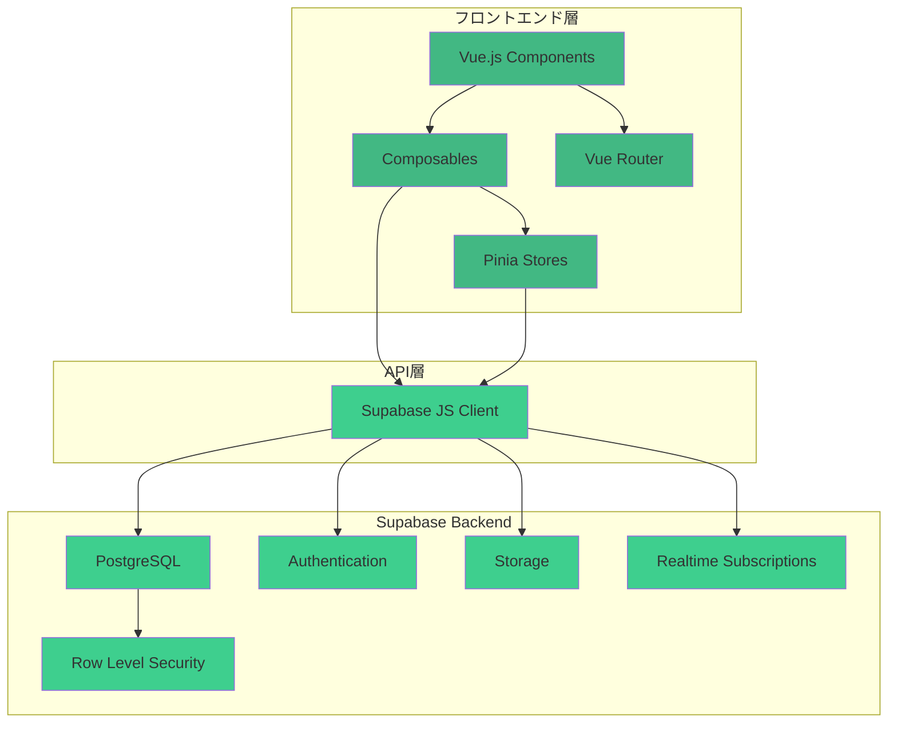
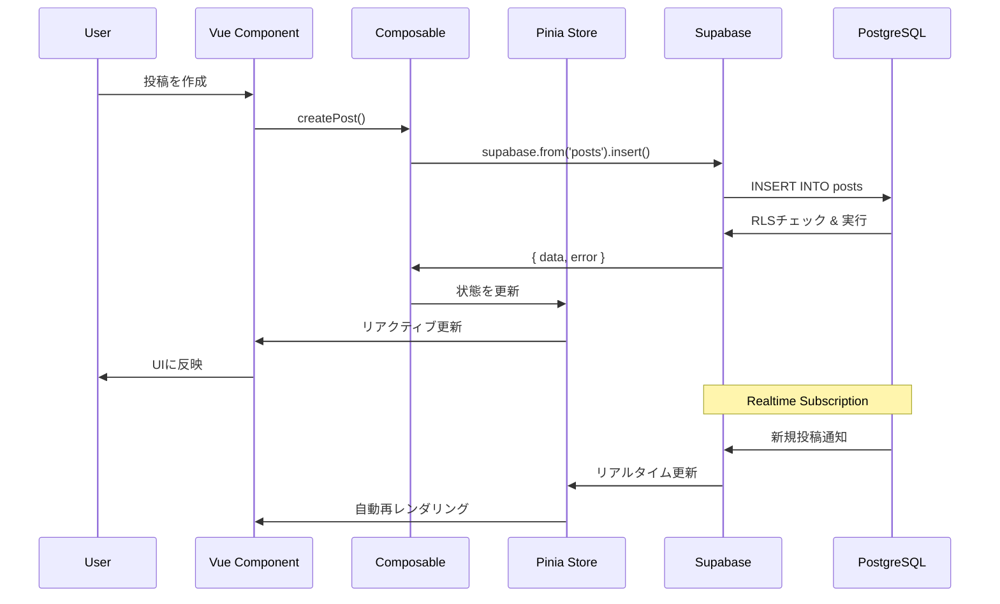
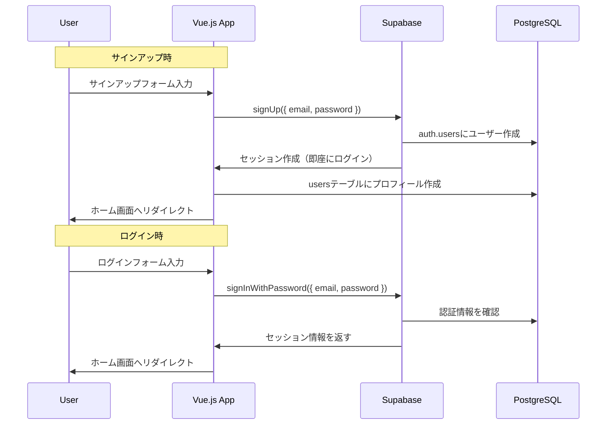

# CLAUDE.md

This file provides guidance to Claude Code (claude.ai/code) when working with code in this repository.

---

## 🎯 プロジェクト目標

Twitter風のSNSサービスをVue.js + Supabase + Vercelで構築する。
ショーケース目的のため、シンプルで保守性の高いコードを優先。

---

## 🏗️ システムアーキテクチャ



### データフロー図



---

## 📁 プロジェクト構造

```
twitter-clone/
├── src/
│   ├── assets/              # 静的ファイル
│   │   └── styles/
│   │       └── main.css
│   ├── components/          # Vue コンポーネント
│   │   ├── auth/           # 認証関連
│   │   │   ├── LoginForm.vue
│   │   │   ├── LogoutButton.vue
│   │   │   └── UserProfile.vue
│   │   ├── posts/          # 投稿関連
│   │   │   ├── PostCard.vue
│   │   │   ├── PostForm.vue
│   │   │   ├── Timeline.vue
│   │   │   ├── LikeButton.vue
│   │   │   └── RepostButton.vue
│   │   ├── users/          # ユーザー関連
│   │   │   ├── UserCard.vue
│   │   │   ├── FollowButton.vue
│   │   │   ├── IconPicker.vue
│   │   │   └── ProfileEdit.vue
│   │   └── common/         # 共通コンポーネント
│   │       ├── Header.vue
│   │       ├── Sidebar.vue
│   │       ├── LoadingSpinner.vue
│   │       └── ToastNotification.vue
│   ├── composables/        # Vue Composition API
│   │   ├── useAuth.js      # 認証ロジック
│   │   ├── usePosts.js     # 投稿CRUD（無限スクロール対応）
│   │   ├── useLikes.js     # いいね機能
│   │   ├── useReposts.js   # リポスト機能
│   │   ├── useFollows.js   # フォロー機能
│   │   └── useToast.js     # トースト通知
│   ├── lib/                # ライブラリ設定
│   │   └── supabase.js     # Supabase初期化
│   ├── router/             # Vue Router
│   │   └── index.js
│   ├── stores/             # Pinia Store
│   │   ├── auth.js         # 認証状態
│   │   ├── posts.js        # 投稿データ
│   │   └── users.js        # ユーザーデータ
│   ├── views/              # ページコンポーネント
│   │   ├── Home.vue        # タイムライン
│   │   ├── Profile.vue     # プロフィール
│   │   ├── PostDetail.vue  # 投稿詳細
│   │   └── Login.vue       # ログイン
│   ├── utils/              # ユーティリティ関数
│   │   ├── date.js         # 日付フォーマット
│   │   ├── validation.js   # バリデーション
│   │   └── icons.js        # アイコンプリセット定義
│   ├── App.vue
│   └── main.js
├── public/
├── supabase/               # Supabaseマイグレーション
│   └── migrations/
│       ├── 001_initial_schema.sql
│       ├── 002_add_indexes.sql
│       └── 003_rls_policies.sql
├── .env.example
├── .env
├── .gitignore
├── index.html
├── package.json
├── pnpm-lock.yaml
├── vite.config.js
├── tailwind.config.js
├── postcss.config.js
├── README.md
└── CLAUDE.md
```

---

## 🗄️ Supabase セットアップ

### 1. プロジェクト作成

1. https://supabase.com にアクセス
2. 「New Project」をクリック
3. プロジェクト設定
   - **Name**: `twitter-clone`
   - **Database Password**: 強力なパスワードを生成（保存必須）
   - **Region**: `Northeast Asia (Tokyo)` - ap-northeast-1
   - **Pricing Plan**: Free

### 2. データベーススキーマの作成

**📁 マイグレーションファイルは `supabase/migrations/` ディレクトリに用意されています。**

詳細な実行手順は [supabase/README.md](../supabase/README.md) を参照してください。

#### 実行手順の概要

1. Supabase Dashboard → SQL Editor → New Query
2. 以下のマイグレーションファイルを**順番に**実行：
   - `001_initial_schema.sql` - テーブル作成
   - `002_add_indexes.sql` - インデックス追加
   - `003_rls_policies.sql` - セキュリティポリシー設定
   - `004_views_and_functions.sql` - ビュー・関数作成

3. Realtime有効化（Database → Replication）
   - posts, likes, reposts, followsテーブルを有効化

#### スキーマ構成

**テーブル一覧**:
- `users` - ユーザー情報（icon: アイコンID）
- `posts` - 投稿（reposts_count: リポスト数）
- `likes` - いいね
- `reposts` - リポスト（新規）
- `follows` - フォロー関係

**主要な関数**:
- `increment_likes_count()` / `decrement_likes_count()`
- `increment_reposts_count()` / `decrement_reposts_count()`
- `get_followers_count()` / `get_following_count()`

完全なスキーマとRLSポリシーは `supabase/migrations/` を参照してください。

### 3. Authentication 設定

#### メール/パスワード認証を有効化

1. Supabase Dashboard → Authentication → Providers
2. **Email** が既にデフォルトで有効化されています
3. 設定を確認・変更:
   - **Enable Email provider**: ON
   - **Confirm email**: **OFF**（開発を迅速化するため、メール確認を無効化）
   - **Secure email change**: ON（推奨）

> **重要**: このプロジェクトでは開発効率を優先し、メール確認を無効化します。本番環境では有効化を検討してください。

#### メール確認OFF時の動作

- サインアップ後、即座にログイン可能
- メール確認のステップが不要
- 開発・テスト時のユーザー作成が迅速

#### 認証フロー図（メール確認OFF版）



---

## 💻 Vue.js 実装ガイド

### Supabase クライアントの初期化

#### `src/lib/supabase.js`

- 役割: Supabase クライアントの初期化と共通テーブル定数の定義を担当。
- 備考: 環境変数が未設定でも動作するため、本番では必ず URL とキーを設定すること。


---

### Composables パターン

#### `src/composables/useAuth.js`

- 役割: サインアップ／ログイン／パスワードリセットなど認証処理をまとめた composable。
- 主な API: signUp, signIn, signOut, resetPassword, initAuth。詳細はファイル本体を参照。


#### `src/composables/usePosts.js`

- 役割: 投稿取得・作成・削除とリアルタイム購読を扱う composable。
- 備考: Realtime チャンネルで新規投稿と削除を監視する。


#### `src/composables/useLikes.js`

- 役割: いいねの追加／削除とカウンタ更新 RPC をラップする composable。
- 注意: RLS 制約のため実行前にログイン済みか確認すること。


---

### 新機能の実装ガイド

#### `src/utils/icons.js` - アイコンプリセットシステム

- 役割: プリセットアイコンのリストとヘルパー関数を提供。
- 備考: デフォルトは icon-cat。


#### `src/composables/useReposts.js` - リポスト機能

- 役割: リポストの追加／削除とカウンタ更新 RPC を提供する composable。
- 備考: 投稿一覧の表示更新は呼び出し側で行う。


#### `src/composables/useToast.js` - トースト通知システム

- 役割: トースト通知スタックの管理と success / error などのショートカットを提供。
- 備考: ToastNotification コンポーネントから共有して利用する。


#### `src/components/common/ToastNotification.vue`

- 役割: トースト通知をリスト表示し、クリックで閉じられる共通コンポーネント。
- 備考: Tailwind ベースのスタイル。


---

### データベース関数の追加

いいね数・リポスト数のカウント管理を効率化するため、以下の関数をSupabaseに追加します：

```sql
-- いいね数を増やす関数
CREATE OR REPLACE FUNCTION increment_likes_count(post_id UUID)
RETURNS VOID AS $$
BEGIN
  UPDATE posts
  SET likes_count = likes_count + 1
  WHERE id = post_id;
END;
$$ LANGUAGE plpgsql SECURITY DEFINER;

-- いいね数を減らす関数
CREATE OR REPLACE FUNCTION decrement_likes_count(post_id UUID)
RETURNS VOID AS $$
BEGIN
  UPDATE posts
  SET likes_count = GREATEST(likes_count - 1, 0)
  WHERE id = post_id;
END;
$$ LANGUAGE plpgsql SECURITY DEFINER;

-- リポスト数を増やす関数
CREATE OR REPLACE FUNCTION increment_reposts_count(post_id UUID)
RETURNS VOID AS $$
BEGIN
  UPDATE posts
  SET reposts_count = reposts_count + 1
  WHERE id = post_id;
END;
$$ LANGUAGE plpgsql SECURITY DEFINER;

-- リポスト数を減らす関数
CREATE OR REPLACE FUNCTION decrement_reposts_count(post_id UUID)
RETURNS VOID AS $$
BEGIN
  UPDATE posts
  SET reposts_count = GREATEST(reposts_count - 1, 0)
  WHERE id = post_id;
END;
$$ LANGUAGE plpgsql SECURITY DEFINER;
```

---

## 🚀 実装の優先順位

### Phase 1: 基本機能（MVP）
1. ✅ Supabaseプロジェクトセットアップ
2. ✅ データベーススキーマ作成
3. ✅ RLSポリシー設定
4. **メール/パスワード認証実装**
   - LoginForm.vue（サインアップ・ログイン統合）
   - useAuth composable
   - パスワードリセット機能
5. **アイコンシステム実装**
   - icons.js（プリセット定義）
   - IconPicker.vue（アイコン選択UI）
6. **投稿機能**
   - PostForm.vue（文字数カウンター付き）
   - PostCard.vue
   - Timeline.vue（タブ機能：「ホーム」「すべて」）
   - usePosts composable（無限スクロール対応）
7. **基本レイアウト**
   - Header.vue
   - Home.vue（タブ切り替え機能）
   - ToastNotification.vue（トースト通知システム）

### Phase 2: インタラクション
1. **いいね機能**
   - LikeButton.vue
   - useLikes composable
   - いいね数のリアルタイム更新
2. **リポスト機能**
   - RepostButton.vue
   - useReposts composable
   - リポスト数のリアルタイム更新
3. **投稿削除機能**

### Phase 3: 拡張機能
1. **プロフィールページ**
   - Profile.vue
   - UserCard.vue
   - ProfileEdit.vue（表示名・アイコン・自己紹介・パスワード編集）
2. **フォロー機能**
   - FollowButton.vue
   - useFollows composable
   - フォロー数のリアルタイム更新
3. **タイムライン分離**
   - 「ホーム」タブ：フォロー中のユーザーの投稿
   - 「すべて」タブ：全ユーザーの投稿

### Phase 4: 追加機能（オプション）
1. **ハッシュタグ機能**
   - ハッシュタグの抽出と保存
   - ハッシュタグ検索
2. **検索機能**
   - ユーザー検索
   - 投稿検索
3. **通知機能**
   - いいね通知
   - フォロー通知
   - リポスト通知

---

## 💡 開発のヒント

### Claude Code CLI での開発時
1. このファイル（CLAUDE.md）とREADME.mdを必ず参照
2. コンポーネントは小さく分割して再利用性を高める
3. Supabase操作はcomposablesに集約
4. エラーハンドリングを必ず実装
5. コンソールログで動作確認しながら進める
6. **機能実装後は必ずドキュメントを更新**
7. **コミット前にCLAUDE.mdの方針に沿っているか確認**
8. **RLSポリシーを理解してから実装を開始**

### コード品質
- ESLintとPrettierを使用
- コミット前にlintチェック
- コンポーネントは100行以内を目安に
- **日本語でわかりやすいコメントを記述**
- **変数名・関数名は英語、コメントは日本語**
- SQLクエリは可読性を重視してフォーマット

### Pull Request のテンプレート
```markdown
## 変更内容
<!-- 何を変更したか簡潔に説明 -->

## 変更理由
<!-- なぜこの変更が必要か -->

## 影響範囲
<!-- どのファイル・機能に影響するか -->

## テスト内容
- [ ] ローカルで動作確認済み
- [ ] RLSポリシーを確認
- [ ] レスポンシブ対応を確認
- [ ] エラーハンドリングを確認

## スクリーンショット
<!-- UI変更がある場合は画像を添付 -->

## 関連Issue
<!-- 関連するIssue番号があれば記載 -->

## チェックリスト
- [ ] コードコメントを日本語で記述
- [ ] コミットメッセージを日本語で記述
- [ ] README.md/CLAUDE.mdを更新（必要な場合）
- [ ] Lintエラーがない
- [ ] 不要なconsole.logを削除
- [ ] Supabase RLSポリシーが正しく動作
```

---

## 🔍 トラブルシューティング

### よくある問題

#### 1. RLS エラー: "new row violates row-level security policy"
**原因**: RLSポリシーが正しく設定されていない  
**解決**: 
- Supabase Dashboard → Authentication でユーザーがログインしているか確認
- SQL Editorでポリシーを確認
- `auth.uid()`が正しく機能しているか確認

#### 2. 認証エラー: "Invalid Refresh Token"
**原因**: セッションの有効期限切れ  
**解決**: 
- ログアウトして再ログイン
- `supabase.auth.refreshSession()`を実行

#### 3. CORS エラー
**原因**: Vercelの本番URLがSupabaseの許可リストに未登録  
**解決**: 
- Supabase Dashboard → Settings → API
- Site URLとRedirect URLsに本番URLを追加

#### 4. リアルタイム更新が動作しない
**原因**: Realtimeが有効化されていない  
**解決**:
- Supabase Dashboard → Database → Replication
- 該当テーブルのRealtimeを有効化

---

## 📚 参考リソース

- [Vue.js 公式ドキュメント](https://ja.vuejs.org/)
- [Supabase 公式ドキュメント](https://supabase.com/docs)
- [Supabase JavaScript SDK](https://supabase.com/docs/reference/javascript/introduction)
- [PostgreSQL ドキュメント](https://www.postgresql.jp/document/)
- [Vercel ドキュメント](https://vercel.com/docs)
- [Tailwind CSS](https://tailwindcss.com/)

