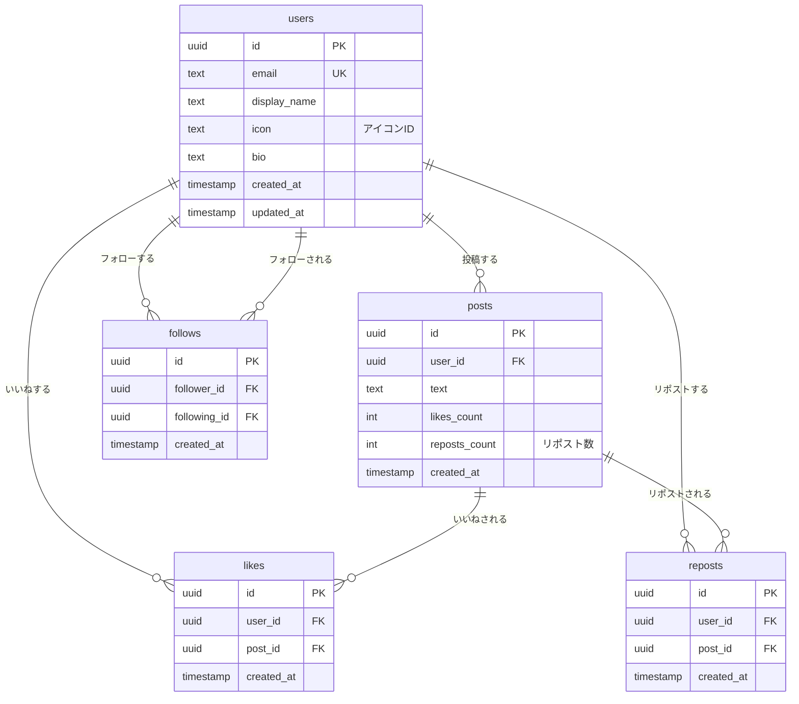

# Twitter風SNSサービス

ショーケース目的で作成する、誰でも投稿可能なTwitterライクなSNSサービスです。

## 📋 プロジェクト概要

- **目的**: ポートフォリオ/ショーケース用のSNSアプリケーション
- **コンセプト**: シンプルで使いやすいTwitter風の投稿プラットフォーム

## 🏗️ アーキテクチャ

```mermaid
graph TB
    subgraph "クライアント"
        A[Vue.js SPA]
    end
    
    subgraph "Vercel"
        B[静的ホスティング]
    end
    
    subgraph "Supabase"
        C[PostgreSQL Database]
        D[Authentication]
        E[Storage]
        F[Realtime]
        G[Email Service]
    end
    
    A --> B
    A --> C
    A --> D
    A --> E
    A --> F
    D --> G
    
    style A fill:#42b883
    style B fill:#000
    style C fill:#3ecf8e
    style D fill:#3ecf8e
    style E fill:#3ecf8e
    style F fill:#3ecf8e
    style G fill:#3ecf8e
```



## 🛠 技術スタック

### フロントエンド
- **Vue.js 3** - メインフレームワーク
- **Vite** - ビルドツール
- **Tailwind CSS** - スタイリング
- **Pinia** - 状態管理

### バックエンド・インフラ
- **Supabase** - BaaS（Backend as a Service）
  - PostgreSQL - リレーショナルデータベース
  - Authentication - **メール/パスワード認証のみ**（Confirm email: OFF）
  - Realtime - リアルタイム更新（投稿・いいね・リポスト・フォロー）
  - Row Level Security (RLS) - 行レベルセキュリティ
- **Vercel** - ホスティング・デプロイ

### プラン
- **Supabase Free tier**
  - Database: 500MB
  - Storage: 1GB
  - Auth Users: 50,000 MAU
  - Realtime: 200同時接続
  - API Requests: 無制限（帯域制限あり）

## 📊 データベース設計

### ER図



### テーブル詳細

#### users（ユーザー）
| カラム名 | 型 | 制約 | 説明 |
|---------|-----|------|------|
| id | UUID | PRIMARY KEY | Supabase Auth連携 |
| email | TEXT | UNIQUE, NOT NULL | メールアドレス |
| display_name | TEXT | NOT NULL | 表示名 |
| icon | TEXT | DEFAULT 'icon-cat', NOT NULL | アイコンID（プリセットから選択） |
| bio | TEXT | | 自己紹介 |
| created_at | TIMESTAMP | DEFAULT NOW() | 作成日時 |
| updated_at | TIMESTAMP | DEFAULT NOW() | 更新日時 |

#### posts（投稿）
| カラム名 | 型 | 制約 | 説明 |
|---------|-----|------|------|
| id | UUID | PRIMARY KEY | 投稿ID |
| user_id | UUID | FOREIGN KEY, NOT NULL | 投稿者ID |
| text | TEXT | NOT NULL, CHECK(1-280文字) | 投稿内容 |
| likes_count | INTEGER | DEFAULT 0, CHECK(>=0) | いいね数 |
| reposts_count | INTEGER | DEFAULT 0, CHECK(>=0) | リポスト数 |
| created_at | TIMESTAMP | DEFAULT NOW() | 投稿日時 |

#### likes（いいね）
| カラム名 | 型 | 制約 | 説明 |
|---------|-----|------|------|
| id | UUID | PRIMARY KEY | いいねID |
| user_id | UUID | FOREIGN KEY, NOT NULL | いいねしたユーザー |
| post_id | UUID | FOREIGN KEY, NOT NULL | いいねされた投稿 |
| created_at | TIMESTAMP | DEFAULT NOW() | いいね日時 |
| - | - | UNIQUE(user_id, post_id) | 重複防止 |

#### reposts（リポスト）
| カラム名 | 型 | 制約 | 説明 |
|---------|-----|------|------|
| id | UUID | PRIMARY KEY | リポストID |
| user_id | UUID | FOREIGN KEY, NOT NULL | リポストしたユーザー |
| post_id | UUID | FOREIGN KEY, NOT NULL | リポストされた投稿 |
| created_at | TIMESTAMP | DEFAULT NOW() | リポスト日時 |
| - | - | UNIQUE(user_id, post_id) | 重複防止 |

#### follows（フォロー）
| カラム名 | 型 | 制約 | 説明 |
|---------|-----|------|------|
| id | UUID | PRIMARY KEY | フォローID |
| follower_id | UUID | FOREIGN KEY, NOT NULL | フォローする人 |
| following_id | UUID | FOREIGN KEY, NOT NULL | フォローされる人 |
| created_at | TIMESTAMP | DEFAULT NOW() | フォロー日時 |
| - | - | UNIQUE(follower_id, following_id) | 重複防止 |
| - | - | CHECK(follower_id != following_id) | 自己フォロー防止 |

## 🎯 主要機能（MVP）

### フェーズ1 - コア機能
- [ ] Supabaseプロジェクトセットアップ
- [ ] データベーススキーマ作成（users, posts, likes, reposts, follows）
- [ ] **メール/パスワード認証**（Confirm email: OFF）
  - サインアップ・ログイン統合フォーム
  - パスワードリセット機能
- [ ] **アイコンシステム**
  - プリセットアイコン（絵文字）から選択
  - アイコン選択UI
- [ ] **投稿機能**
  - 投稿の作成・表示（文字数カウンター: 280文字制限）
  - タイムライン表示（「ホーム」「すべて」タブ）
  - 無限スクロール
- [ ] **トースト通知システム**（エラー・成功メッセージ）
- [ ] 投稿の削除（自分の投稿のみ）

### フェーズ2 - インタラクション
- [ ] **いいね機能**
  - いいね/いいね解除
  - いいね数のリアルタイム更新
- [ ] **リポスト機能**
  - リポスト/リポスト解除
  - リポスト数のリアルタイム更新
- [ ] リアルタイム投稿更新（新規投稿・削除の即時反映）

### フェーズ3 - 拡張機能
- [ ] **プロフィールページ**
  - ユーザープロフィール表示
  - プロフィール編集（表示名・アイコン・自己紹介・パスワード）
- [ ] **フォロー機能**
  - フォロー/アンフォロー
  - フォロー数・フォロワー数のリアルタイム更新
- [ ] **タイムライン分離**
  - 「ホーム」タブ：フォロー中のユーザーの投稿のみ
  - 「すべて」タブ：全ユーザーの投稿

### フェーズ4 - 追加機能（オプション）
- [ ] **ハッシュタグ機能**
  - ハッシュタグの抽出と検索
- [ ] **検索機能**
  - ユーザー検索
  - 投稿検索
- [ ] **通知機能**
  - いいね通知
  - フォロー通知
  - リポスト通知

## 🚀 セットアップ

### 前提条件
- Node.js 18以上
- **pnpm** (パッケージマネージャー)
- Supabaseアカウント
- メールアドレス（開発・テスト用）

### pnpm のインストール
```bash
npm install -g pnpm
```

### プロジェクトの初期化
```bash
# Vue.jsプロジェクト作成
pnpm create vue@latest twitter-clone

# プロジェクトディレクトリに移動
cd twitter-clone

# 依存関係をインストール
pnpm install

# Supabase SDKをインストール
pnpm add @supabase/supabase-js

# Tailwind CSSをインストール（推奨）
pnpm add -D tailwindcss postcss autoprefixer
npx tailwindcss init -p
```

### 環境変数を設定
`.env`ファイルを作成：
```bash
VITE_SUPABASE_URL=https://your-project.supabase.co
VITE_SUPABASE_ANON_KEY=your-anon-key
```

### 開発サーバー起動
```bash
pnpm dev
```

### ビルド
```bash
pnpm build
```

## 📦 デプロイ

### Vercel へのデプロイ
```bash
# Vercel CLIをインストール
pnpm add -g vercel

# デプロイ
vercel

# 環境変数を設定
vercel env add VITE_SUPABASE_URL
vercel env add VITE_SUPABASE_ANON_KEY
```

または、GitHubリポジトリと連携して自動デプロイ。

## 📝 ドキュメント管理

### ドキュメントの更新
このプロジェクトでは、実装の進捗に応じてドキュメントを最新の状態に保ちます：

- **README.md**: 機能追加や仕様変更があった場合は必ず更新
- **CLAUDE.md**: 実装パターンや設計方針の変更があった場合は更新
- 更新内容はGitコミットに含める

### ドキュメント更新のタイミング
- ✅ 新機能の実装完了時
- ✅ データ構造の変更時
- ✅ セットアップ手順の変更時
- ✅ 技術スタックの追加・変更時
- ✅ セキュリティポリシーの更新時
- ✅ ER図やアーキテクチャの変更時

## 🌐 言語方針

このプロジェクトでは、**すべての開発関連コミュニケーションを日本語で統一**します：

### 日本語を使用する場所
- ✅ **コードコメント**: すべて日本語で記述
- ✅ **Gitコミットメッセージ**: 日本語で明確に
- ✅ **Pull Requestのタイトル・説明**: 日本語
- ✅ **コードレビューコメント**: 日本語
- ✅ **Issue/タスク管理**: 日本語
- ✅ **チャットでの議論**: 日本語
- ✅ **ドキュメント**: 日本語

### コミットメッセージの例
```bash
# Good ✅
git commit -m "feat: メール/パスワード認証機能を実装"
git commit -m "fix: タイムラインの表示順序を修正"
git commit -m "docs: README.mdにER図を追加"

# Bad ❌
git commit -m "feat: implement email auth"
git commit -m "fix timeline order"
```

### コードコメントの例
```javascript
// Good ✅
// ユーザーの投稿を取得してタイムラインに表示する
const fetchUserPosts = async (userId) => {
  // Supabaseから最新50件を取得
  const { data, error } = await supabase
    .from('posts')
    .select('*')
    .eq('user_id', userId)
    .order('created_at', { ascending: false })
    .limit(50);
  
  return data;
};

// Bad ❌
// Fetch user posts and display on timeline
const fetchUserPosts = async (userId) => {
  const { data } = await supabase.from('posts').select('*');
  return data;
};
```

## 🔒 セキュリティ

### Row Level Security (RLS)
Supabaseの**RLS（行レベルセキュリティ）**により、各ユーザーは適切なデータのみアクセス可能：

- ✅ 全ユーザーは全投稿を閲覧可能
- ✅ 認証済みユーザーのみ投稿作成可能
- ✅ 自分の投稿のみ削除可能
- ✅ 自分のいいねのみ削除可能
- ✅ 自分のフォローのみ削除可能

詳細は`CLAUDE.md`を参照してください。
