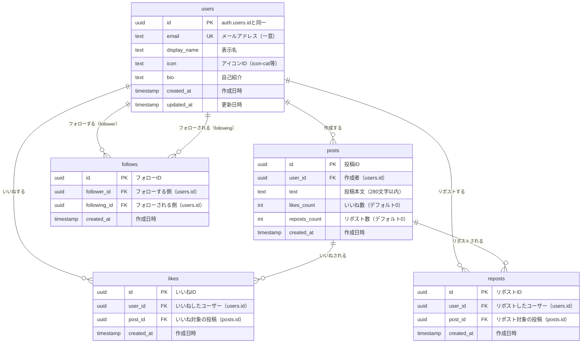

# Supabase マイグレーション

このディレクトリには、Anonymous SNSプロジェクトのSupabaseデータベース設定用のSQLマイグレーションファイルが含まれています。

## 📊 ER図（Entity Relationship Diagram）



### ER図の読み方

- **users**: 認証済みユーザーの情報を保存（`auth.users`と1対1対応）
- **posts**: ユーザーが作成した投稿
- **likes**: ユーザーと投稿の多対多関係（いいね機能）
- **reposts**: ユーザーと投稿の多対多関係（リポスト機能）
- **follows**: ユーザー同士の多対多関係（フォロー機能）

### リレーションシップ

| リレーション | 種類 | 説明 |
|------------|------|------|
| users → posts | 1対多 | 1人のユーザーは複数の投稿を作成可能 |
| users → likes | 1対多 | 1人のユーザーは複数の投稿にいいね可能 |
| posts → likes | 1対多 | 1つの投稿は複数のユーザーからいいねされる |
| users → reposts | 1対多 | 1人のユーザーは複数の投稿をリポスト可能 |
| posts → reposts | 1対多 | 1つの投稿は複数のユーザーからリポストされる |
| users → follows (follower) | 1対多 | 1人のユーザーは複数のユーザーをフォロー可能 |
| users → follows (following) | 1対多 | 1人のユーザーは複数のユーザーにフォローされる |

## 📋 マイグレーションファイル

マイグレーションは**必ず順番通り**に実行してください。

### 1. `001_initial_schema.sql` - 初期スキーマ
**概要**: 基本テーブルの作成
- `users` - ユーザー情報
- `posts` - 投稿
- `likes` - いいね
- `reposts` - リポスト
- `follows` - フォロー関係

**実行方法**:
1. Supabase Dashboard → SQL Editor
2. 「New Query」をクリック
3. `001_initial_schema.sql`の内容を貼り付け
4. 「Run」をクリック

### 2. `002_add_indexes.sql` - インデックス追加
**概要**: パフォーマンス向上のためのインデックス作成
- 投稿の検索速度向上
- いいね・リポストの集計速度向上
- フォロー関係の検索速度向上

**実行方法**:
1. Supabase Dashboard → SQL Editor
2. 「New Query」をクリック
3. `002_add_indexes.sql`の内容を貼り付け
4. 「Run」をクリック

### 3. `003_rls_policies.sql` - Row Level Security
**概要**: セキュリティポリシーの設定
- ユーザーは自分のプロフィールのみ編集可能
- 認証済みユーザーのみ投稿・いいね・リポスト・フォロー可能
- 自分が作成したデータのみ削除可能

**実行方法**:
1. Supabase Dashboard → SQL Editor
2. 「New Query」をクリック
3. `003_rls_policies.sql`の内容を貼り付け
4. 「Run」をクリック

### 4. `004_views_and_functions.sql` - ビュー・関数
**概要**: 便利なビューとヘルパー関数の作成
- タイムライン用ビュー
- いいね・リポスト数の増減関数
- フォロワー・フォロー数取得関数

**実行方法**:
1. Supabase Dashboard → SQL Editor
2. 「New Query」をクリック
3. `004_views_and_functions.sql`の内容を貼り付け
4. 「Run」をクリック

## ✅ 実行確認

すべてのマイグレーションが正常に完了したら、以下を確認してください：

### テーブルの確認
Supabase Dashboard → Table Editor で以下のテーブルが作成されていることを確認：
- ✅ users
- ✅ posts
- ✅ likes
- ✅ reposts
- ✅ follows

### RLSの確認
各テーブルで「RLS enabled」が表示されていることを確認。

### 関数の確認
Supabase Dashboard → Database → Functions で以下の関数が作成されていることを確認：
- ✅ increment_likes_count
- ✅ decrement_likes_count
- ✅ increment_reposts_count
- ✅ decrement_reposts_count
- ✅ get_followers_count
- ✅ get_following_count
- ✅ user_liked_posts

## 🔄 Realtime有効化

リアルタイム更新を使用するため、以下のテーブルでRealtimeを有効化してください：

1. Supabase Dashboard → Database → Replication
2. 以下のテーブルのRealtimeを有効化：
   - ✅ posts
   - ✅ likes
   - ✅ reposts
   - ✅ follows

## 🔐 Authentication設定

1. Supabase Dashboard → Authentication → Providers
2. Email Providerの設定を確認・変更：
   - **Enable Email provider**: ON
   - **Confirm email**: **OFF**（重要！）
   - **Secure email change**: ON

## 🧪 テストデータ（オプション）

開発用にテストデータを作成したい場合は、以下のSQLを実行してください：

```sql
-- テストユーザーの作成（まずSupabase Authでユーザーを作成してから実行）
-- 注意: この例のUUIDは実際のauth.usersのIDに置き換えてください

-- テスト投稿
INSERT INTO posts (user_id, text) VALUES
  ('your-user-id-here', 'これは最初のテスト投稿です！'),
  ('your-user-id-here', 'Supabase + Vue.jsでSNSを作っています。');
```

## 📚 参考資料

- [Supabase公式ドキュメント](https://supabase.com/docs)
- [PostgreSQL RLS](https://supabase.com/docs/guides/auth/row-level-security)
- [Supabase Realtime](https://supabase.com/docs/guides/realtime)
